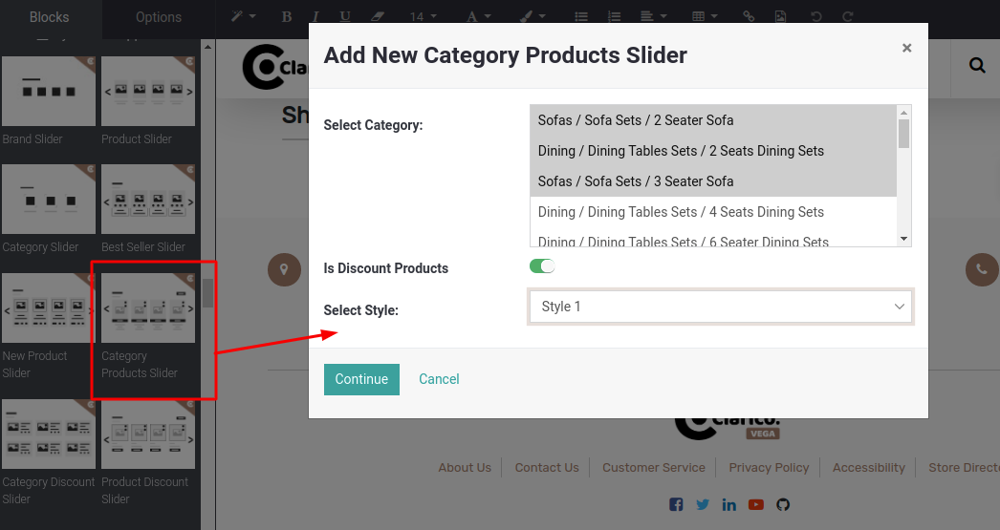
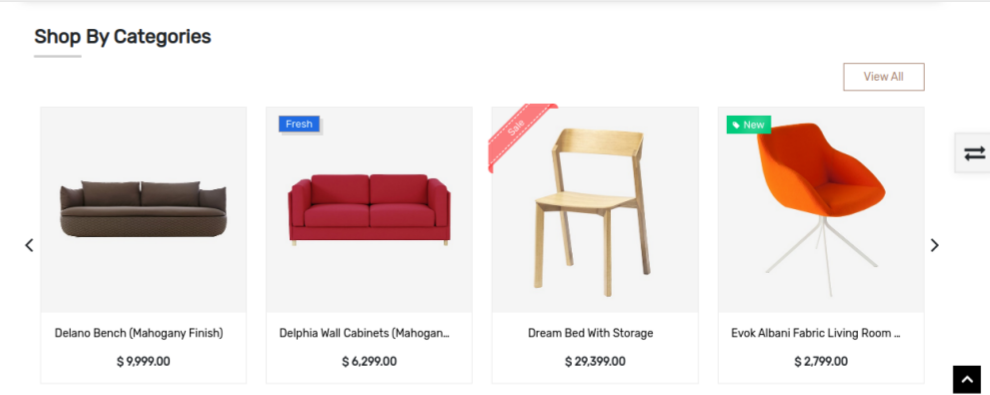

### Advanced Category Product Slider

Advanced Category Product Slider is used to get the dynamic collection of the categories products that have been selected from the list of all categories.

Steps to configure Category product snippet:

* **Step 1:** Open Website Editor from the Website & you can see the ‘Category Product Slider’ snippet inside Dynamic Snippet as shown below screenshot. Once you drag & drop that snippet, one popup will be displayed. Where you can select multiple categories as well as slider style & discount option as per the below screenshot.

