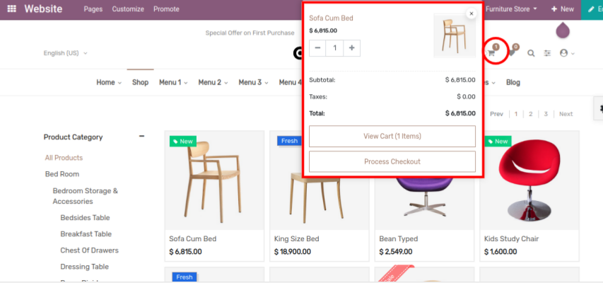

### Advanced Mini Cart

<iframe width="560" height="315" src="https://www.youtube.com/embed/Cb4Hwy7DEqg" title="YouTube video player" frameborder="0" allow="accelerometer; autoplay; clipboard-write; encrypted-media; gyroscope; picture-in-picture" allowfullscreen></iframe>

This feature allows the customer to remove the product from the cart, increase/decrease the product quantity from the cart without navigating to the cart page. To enable/disable the Advance mini cart functionality, go to Web Pages -> Customize - > Customize Theme -> Manage Theme Features. Where you can find configuration named Advanced Mini Cart.

 

