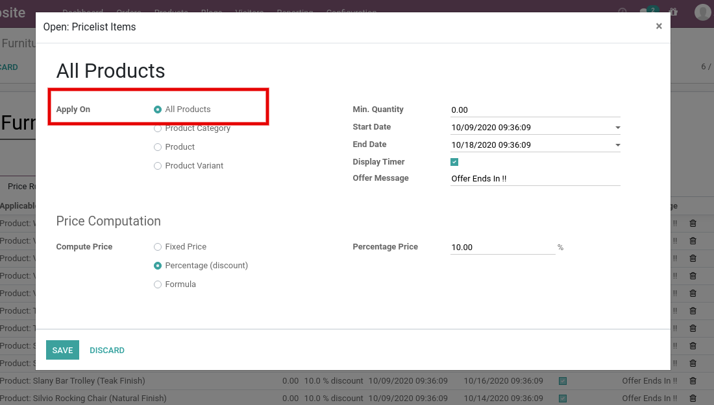
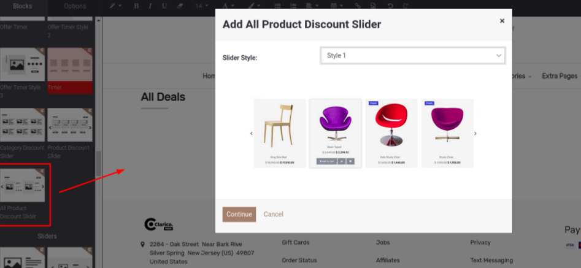

### All Product Discount Slider

All Product Discount Slider is a dynamic snippet which displays all the products if you have configured any pricelist item with All Product option. You can use this snippet in the Brand landing page, Category landing page as per your need. With the help of other discount sliders, you can easily create an Offer Zone/ Offer Page on your website.

Steps to configure All Product Discount Slider:

* **Step 1:** Configure Pricelist item with All Products option as per the below screenshot.

 

* **Step 2:** Open Website Editor from the Website & you can see the ‘All Product Discount Slider’ snippet inside Dynamic Snippet as shown below screenshot. Once you drag & drop that snippet, one popup will be displayed. Where you can select the slider style option as per the below screenshot.

 

