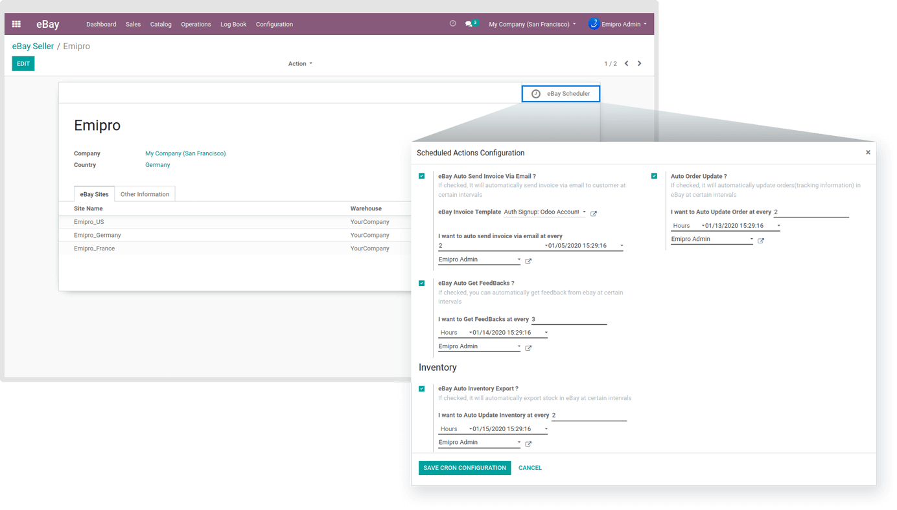

### Inventory

Export the latest stock of your Odoo to eBay at certain time intervals. Set the responsible user here and you will be able to see the date and time of the next job that will execute.

The best practice to efficiently manage the Automatic Schedulers is to set the time intervals of different operations in a smart manner. For example, to allocate the proper system resources to all the operations, set the intervals at different times to avoid overload-like situations. The sellers who process thousands of products in a single shot should be very sensitive here. They should test the load taken by the system and configure accordingly, even if it is required multiple times.

 

