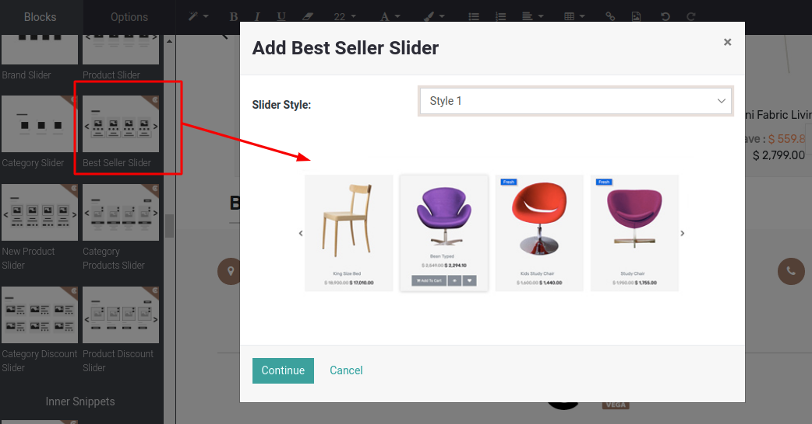
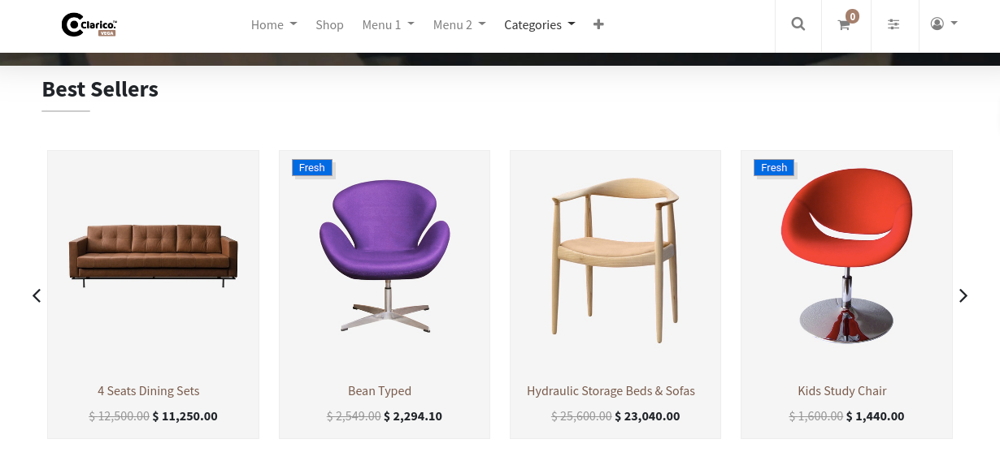

### Bestseller Slider

Bestseller product slider is designed and structured according to the default Odoo workflow. It will take into account the data (Statistics) for the last 8 days of product sales. This snippet can be used anywhere on your website, according to your needs.

Steps to configure Bestseller Slider:

* **Step 1:** Go to the web page and click on the edit button in the top right corner of the web page.
* **Step 2:** Drag and drop ‘Bestseller Slider’ snippet from Dynamic snippet category and select the style from the slider style dropdown as per your requirement and save the changes with the continue button.

