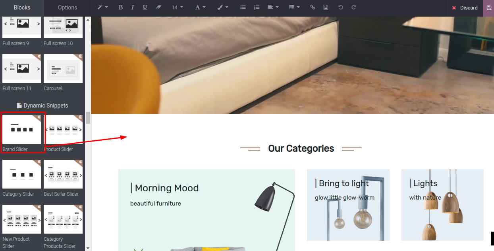

### Brand Slider

The brand slider is a dynamic snippet which displays all the published Brand of the current website in the slider. You can view all the published brands on your current website with this snippet. This Snippet can also be used on the Brand / Category landing page, based on your needs.

Steps to configure Brand Slider:

* **Step 1:**  Open Website Editor from the Website & you can see the Brand Slider’ snippet inside Dynamic Snippet as shown below screenshot. Once you drag & drop that snippet and save the changes.

