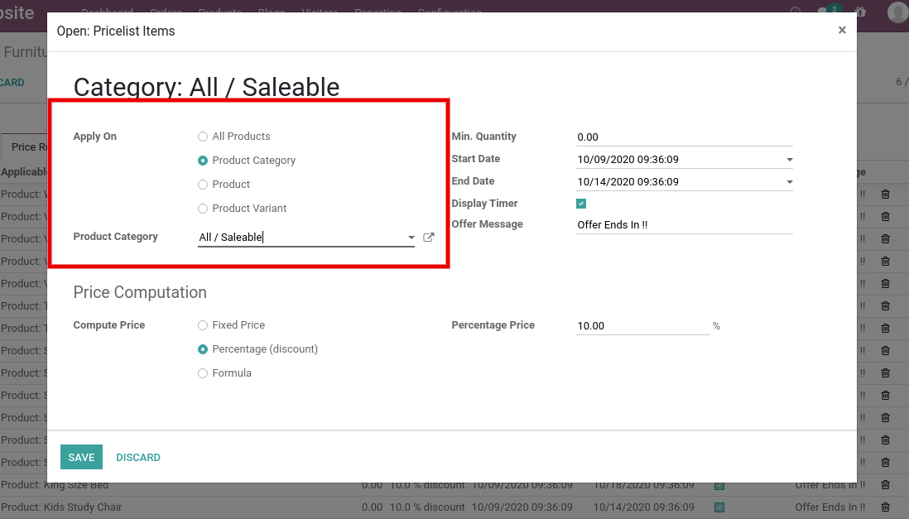
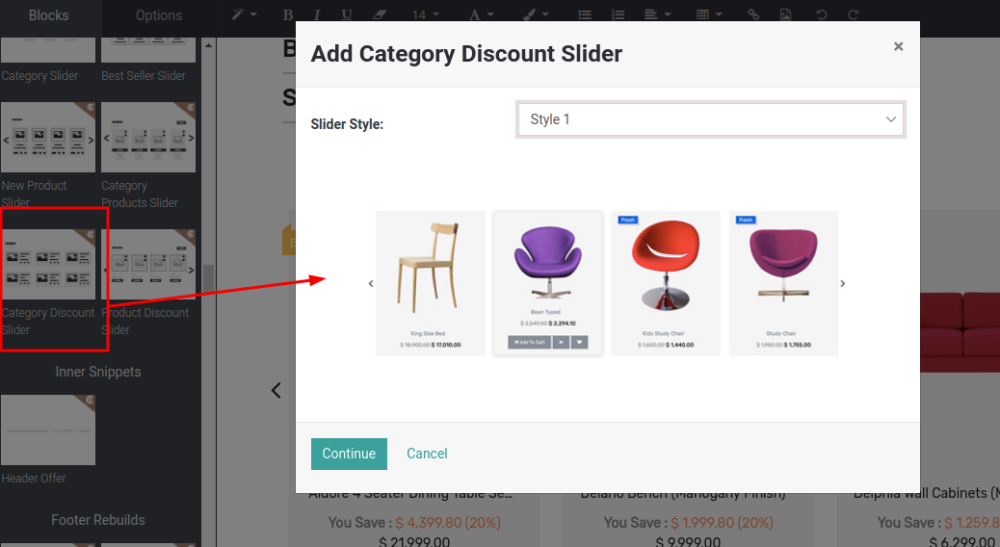

### Category Discount Slider

Category discount slider is a dynamic snippet which displays all the products under those categories which have discounts in the current pricelist. You can select multiple categories for this slider.

You can use this snippet in Brand landing page, Category landing page as per your need. With the help of other discount sliders, you can easily create Offer Zone/ Offer Page on your website.

Steps to configure Category Discount Slider:

* **Step 1:** Configure Pricelist items with category option as per the screenshot.

 

 

* **Step 2:** Open Website Editor from the Website & you can see the ‘Category Discount Slider’ snippet inside Dynamic Snippet as shown below screenshot. Once you drag & drop that snippet, one popup will be displayed. Where you can select slider style option as per the below screenshot.

