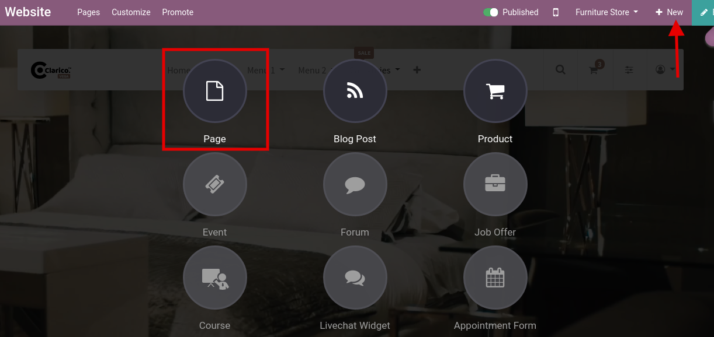
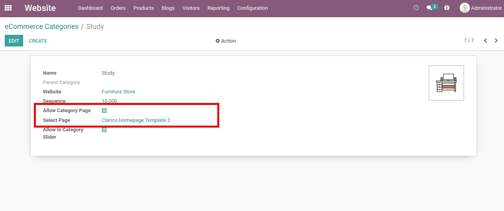

### Category Landing Page

This feature allows you to display the landing page of a specific category. You can easily create some catchy web pages using our snippets and can easily assign it to the category. When customers click on Category from Category Slider at that time it will redirect to that specific category landing page. Where you can show-case your category related CMS blocks, Offers, Product etc.

This feature allows you to view a particular category’s landing page. With these snippets, you can easily build up some catchy web pages and can easily allocate them to the Category.

By clicking Brand from Category Slider, customers will redirect it to that particular category landing page at that time where you can show your brand-related CMS blocks, Offers, Products, etc.

Steps to configure Category Landing Page:

* **Step 1:** Go to the website and click on the new button in the top right corner. Click on **New page** option and one pop will appear to enter the name of the page title and click on the continue button.

 

 

* **Step 2:** It will redirect to the particular page that you have created. Drag and drop the snippets you would like to have on that page and save it.
* **Step 3:** Go to the backend, **Website / Configuration / Product / eCommerce Categories** & open the category record which you want to assign that created page as a Category Landing page.

 

 

As per the above screenshot, Allow Category Page option & assign that page name which you created as the previous screenshot. Go to the website where you configure the Category Slider. When you click on that category, it will redirect you to that Category Landing page instead of the Shop page.

