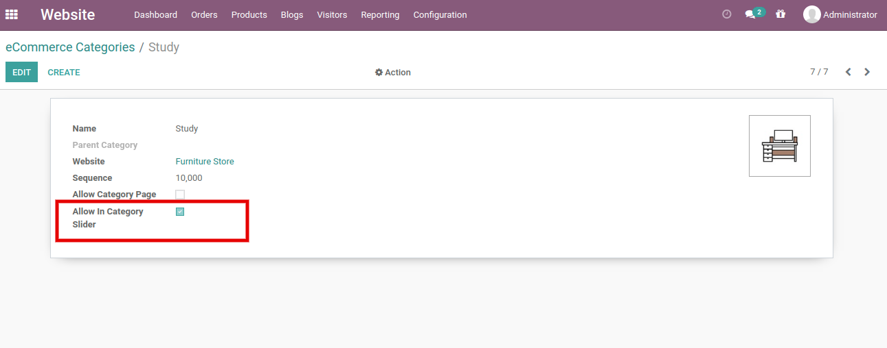
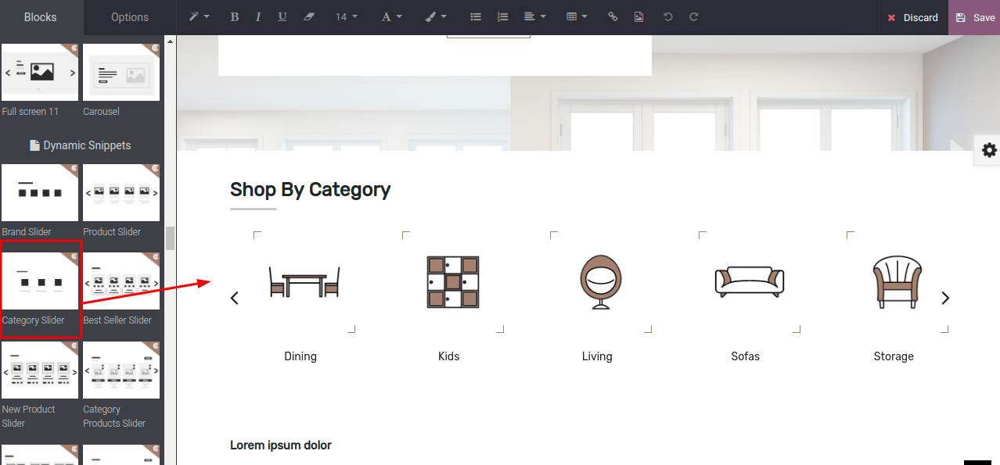

### Category Slider

<iframe width="560" height="315" src="https://www.youtube.com/embed/ntvAbSvaXAo" title="YouTube video player" frameborder="0" allow="accelerometer; autoplay; clipboard-write; encrypted-media; gyroscope; picture-in-picture" allowfullscreen></iframe>

The category slider is a dynamic snippet. It will show the allowed categories in the slider. In order to allow the category, open Ecommerce Category in Odoo backend & enable the option ‘Allow in Category Slider’ as per the below screenshot.

 

 

* **Step 1:**  Open Website Editor from the Website & you can see the ‘Category Slider’ snippet inside Dynamic Snippet as shown below screenshot. Once you drag & drop that snippet and save the changes.

 

{:.alert-info} 
> 
> #### TIP
> 
> Make sure you have added the category image. Otherwise, It will not be displayed in the slider.
> 
> 
> 

