### Clarico Vega Color

**Primary Color :**

We are using the Primary color for our below elements.

* CMS button text color and background color.

* Cart & Wish-list Badges color

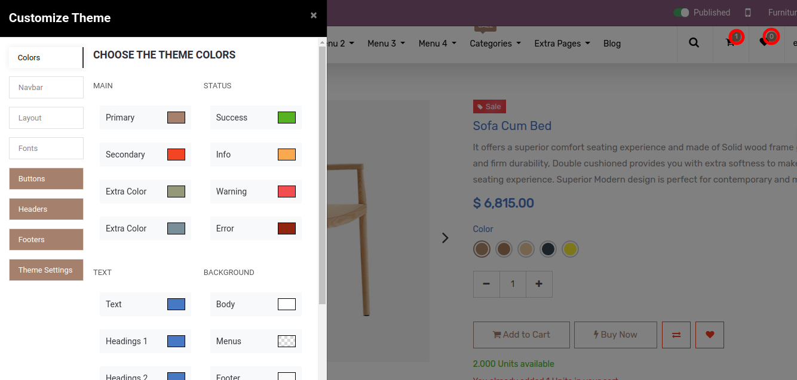

* Link Hover color

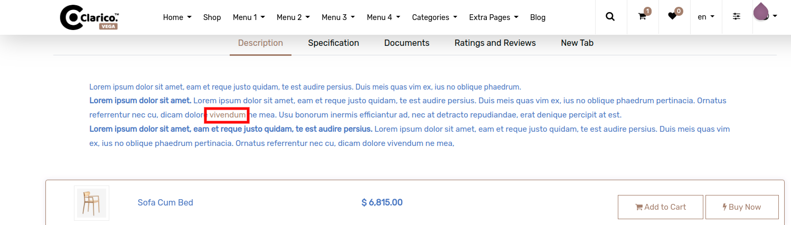

 

**Secondary Color :**

We are using the Secondary color for our below elements.

* Secondary button text color/background (Cart Page)

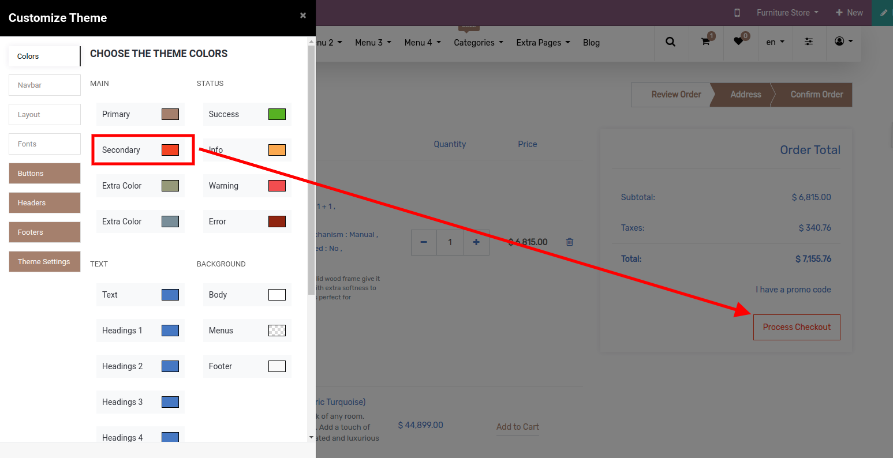

 

**Extra Color 1 (gamma) & Header Text Hover Color:**

* We renamed the label of Extra Color 1 to Header Text Color, And by changing this color it will change menu text color.

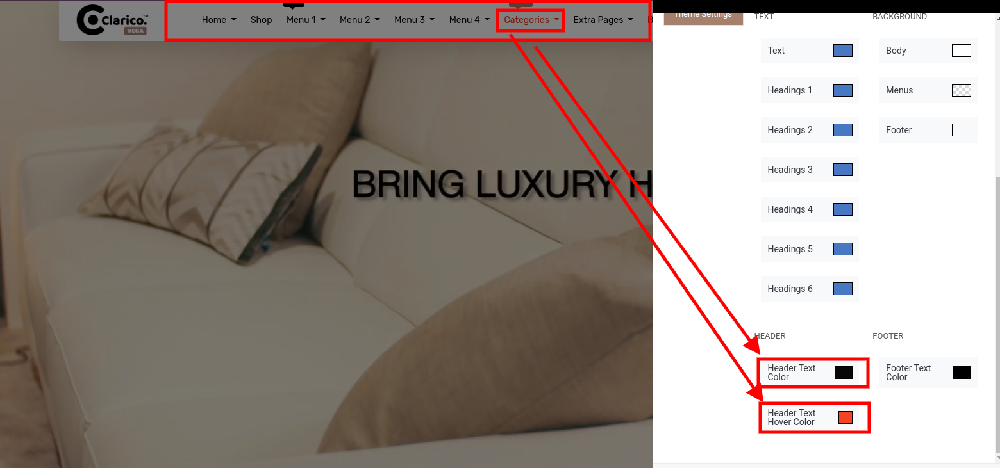

 

**Extra Color 2 (delta):**

* We using this color for button style 16 for the gradient. As start color.

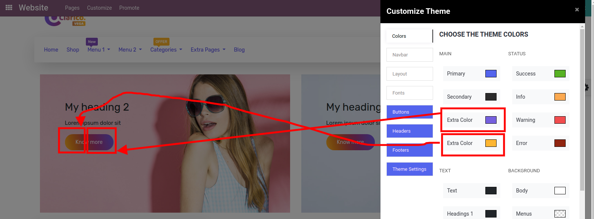

**Extra Color 3 (epsilon):**

* We using this color for button style 16 for the gradient. As end color.

**Text Color:** 

We are using the Secondary color for our below elements.

* In Shop Page Produt Name & Price & Shop page left side navigation text color.

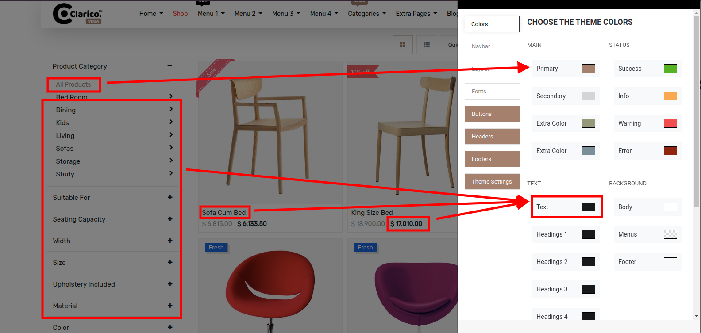

 

* Cart Page & Checkout Page Product attribute Label & Values

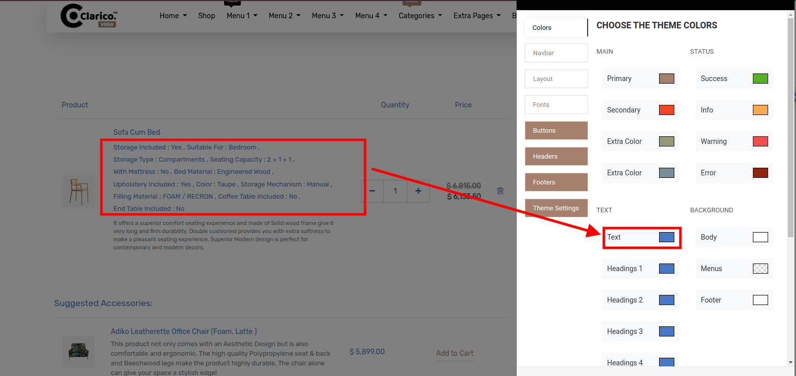

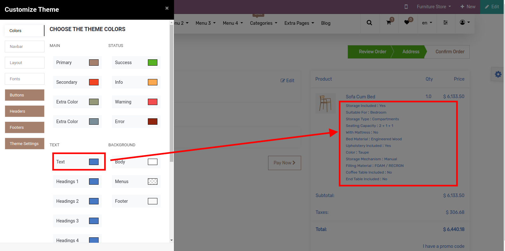

* Checkout Page Shipping Address form.

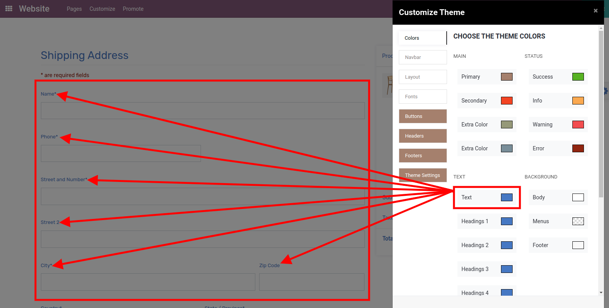

 

**Menus - Background:**

* Able to set the background color of the navbar of the menu. (Background color will not apply to Header Style 8,9,11)

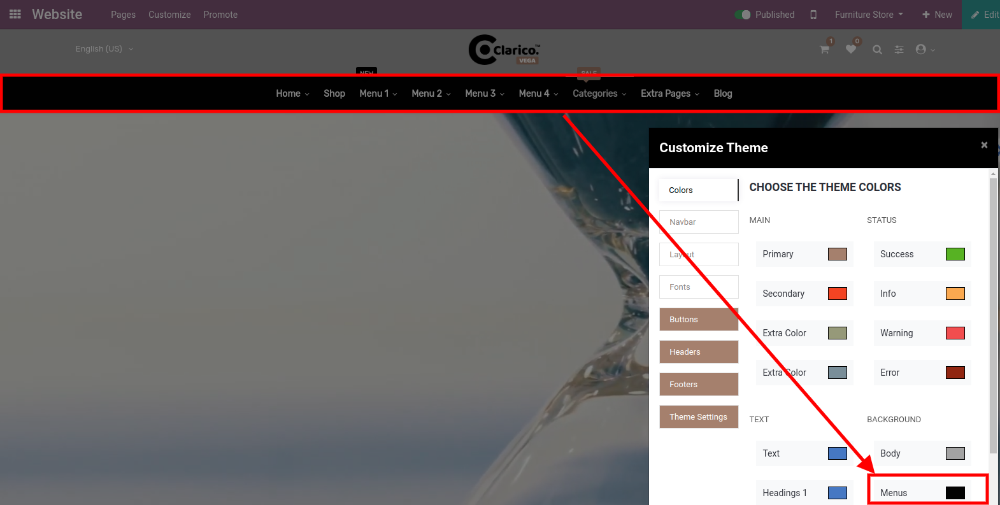

**Body - Background:**

* Able to set the background color of the body.

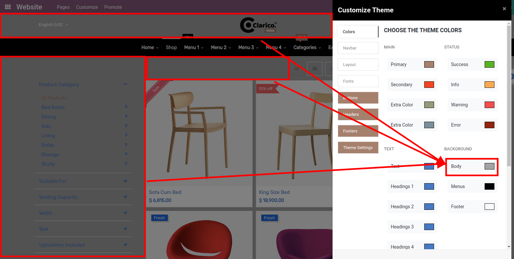

