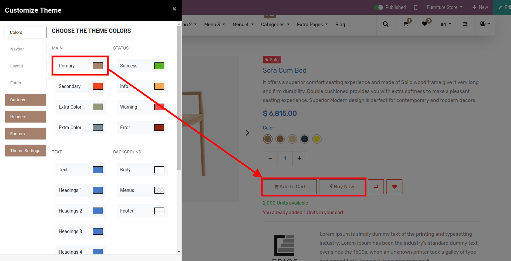

### Dashboard

We are now starting our journey to utilize this connector in order to manage eBay operations in Odoo. After installation, you will see the eBay Odoo Connector icon on the Odoo dashboard. Once you click on it, the eBay Odoo Connector Dashboard can be viewed, in which you can see various eBay Sites along with other details.

From this screen, you can directly perform the Operations of eBay & Odoo. Besides that, you’ll find Settings, Sales Orders, Delivery Orders, and Invoices.

 

