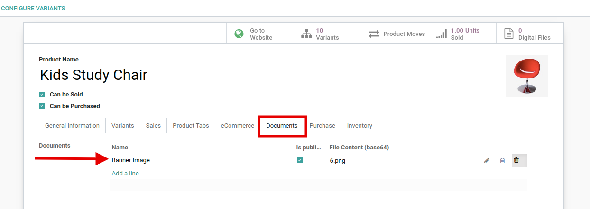
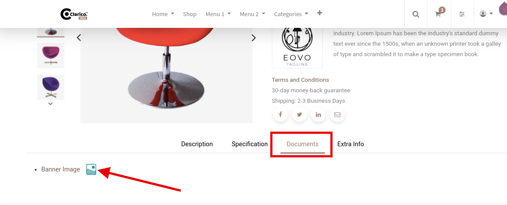

### Documentation Tab On Product Page

<iframe width="560" height="315" src="https://www.youtube.com/embed/YFcHpHHn61o" title="YouTube video player" frameborder="0" allow="accelerometer; autoplay; clipboard-write; encrypted-media; gyroscope; picture-in-picture" allowfullscreen></iframe>

This feature allows you to provide the functionality of downloading any documents from the Product page. Open the product record in Odoo backend view in order to configure the documents as per the below screenshot.

 

 

 

 

As per the above screenshot, you can see that document download link inside the Document tab in the product page.

{:.alert-info} 
> 
> #### TIP
> 
> Don’t forget to make that document as a Public Document for allowing Public users also.
> 
> 
> 

