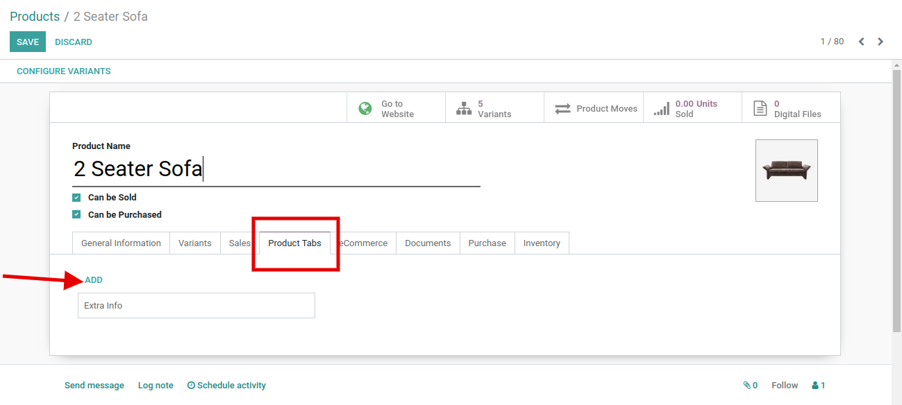
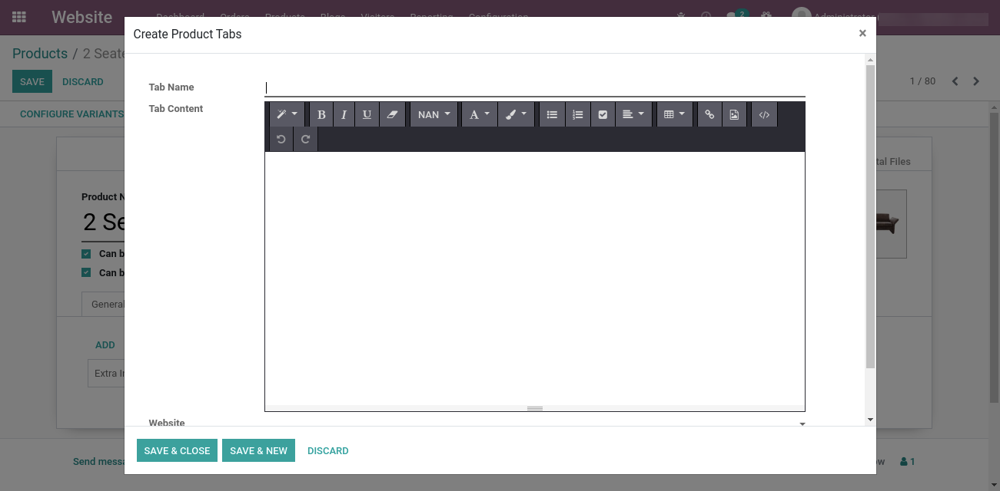
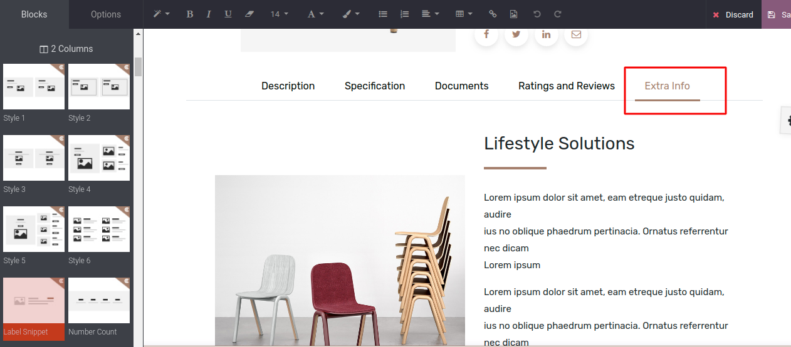

### Dynamic Product Tabs

<iframe width="560" height="315" src="https://www.youtube.com/embed/8_H9I9aMRIw" title="YouTube video player" frameborder="0" allow="accelerometer; autoplay; clipboard-write; encrypted-media; gyroscope; picture-in-picture" allowfullscreen></iframe>

You can easily configure multiple tabs on the product page with this feature. The product tabs can be designed wisely and displayed in the product tab section.

Steps to configure Dynamic product tabs:

* **Step 1:** Go to the Product backend of a particular product where you want to add the extra tab and click on the edit button.

 

 

* **Step 2:** Simply go to the Product tab option, you will find the **Add** link. By clicking on the **Add** link Create Product Tabs popup will appear. Specify the Tab name, Content (you can directly add Html content over there) and you can set this option for web-site as well.

 

If a website is not selected while creating a tab then it shows in every web-site where you installed the theme.

* **Step 3:** Go to the product page in the website & click on the **Edit** button from top right. You can configure the snippets inside the product tab as shown in below screenshot.

 

