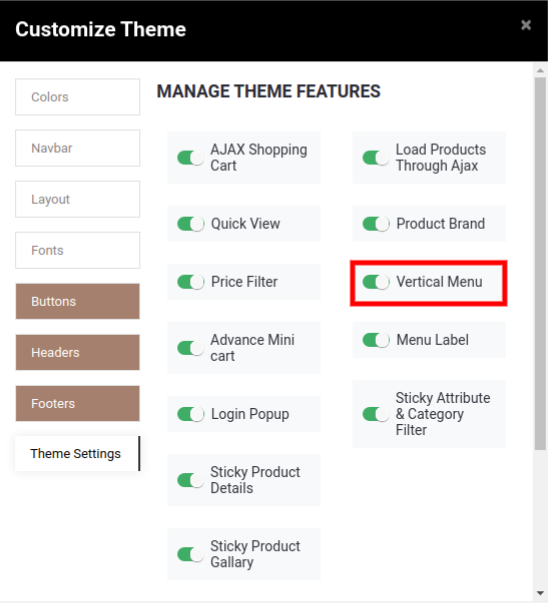

### eBay Listing Templates

An eBay listing template is a pre-made layout that you can use when listing items to eBay. It helps you to achieve consistency across your eBay listings, while also making it quick and easy to add new products to the platform. With listing templates you no longer have to start from scratch every time you list an item. They also help ensure that you give buyers consistent information across all your listings. Once you have set up a template, it’s easy to revise, rename, or delete it.

  

After you configure necessary details in all products, when you export/update products in eBay at that time system will open a pop-up window in which you can select any eBay listing template, and based on the information configured on the selected template, details will be updated in eBay store for each of the exported product. Navigate to **eBay / Catalog / eBay Listing Templates** and you will be able to see all the templates that you have created in past. To create a new template, click on **Create** button.

Enter the name for your new eBay Listing Template. After that, you will be asked to check the option Is **eBay Seller Policy?** If you have set any policies in eBay then you should check this option. However, that policy will be imported when you perform the GetUserPreferences operation.

 

