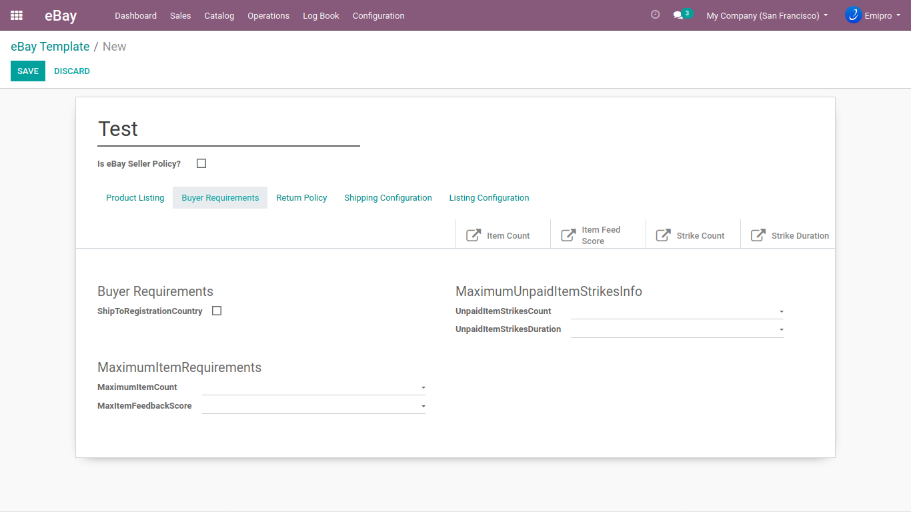

### Buyers Requirements

Here, you can configure the Buyer’s policy for the product. It will be applicable when the customer purchases that product from the eBay store. Buyer Requirements from eBay should be derived in your Odoo post executing the eBay operation GeteBaydetails.

**ShipToRegistrationCountry:** The seller includes and sets this field to true as a mechanism to block bidders who reside (according to their eBay primary shipping address) in countries that are on the ship-to exclusion list. This means that if the buyer's primary shipping address is in a country that you do not ship to, or if you've excluded certain countries from your shipping list, then they cannot bid on your products.

**UnpaidItemStrikesCount:** The maximum number of unpaid item strikes that a prospective buyer is allowed to have during a specified time period **(****MaximumUnpaidItemStrikesInfo.Period****)** before being blocked from buying/bidding on the item.

**UnpaidItemStrikesDuration:** The length of time over which a prospective buyer's unpaid item strikes will be counted. If the prospective buyer's number of unpaid item strikes during this defined period exceeds the value set in the Count field, that prospective buyer is blocked from buying/bidding on the item.

For example, if the **Count** value is 2, and the specified Period is 'Days\_30' (counting back 30 days from the present day), any prospective buyer that has had three or more unpaid item strikes is blocked from buying/bidding on the item.

**MaximumItemCount:** This field is conditionally required if the **MaximumItemRequirements** container is used.

The value of this field specifies the **maximum quantity** of an order line item that a prospective buyer may purchase from the seller during any given 10-day period. The prospective buyer will be blocked from bidding/buying once this value is reached.

{:.alert-info} 
> 
> #### TIP
> 
> Valid values for the US site: 1, 2, 3, 4, 5, 6, 7, 8, 9, 10, 25, 50, 75, and 100.
> 
> 
> 

**MaxItemFeedbackScore:** This is an optional field that is ignored if a **MaximumItemCount** value has not been provided.

If this field is used, a prospective buyer is blocked from bidding/buying if they have reached or exceeded the **MaximumItemCount** and their feedback score is less than the value of this field. 

{:.alert-info} 
> 
> #### TIP
> 
> Valid values for the US site: 0, 1, 2, 3, 4, and 5.
> 
> 
> 

 

