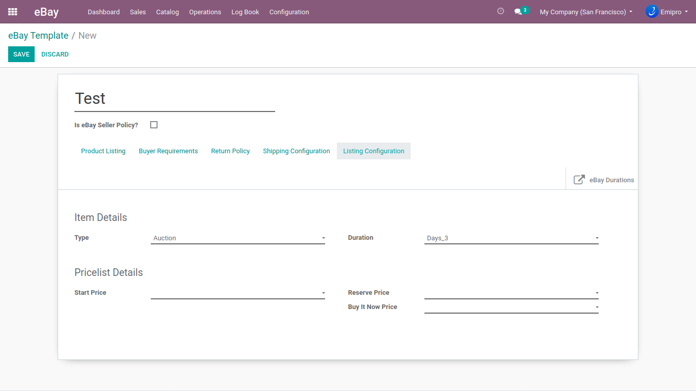

### Listing Configuration

Here you can configure Product Type (Fix Price, Auction, Classified Ad), Duration (Number of days product will active in eBay), Price List Information (System will take price based on a template to configure pricelist).

{:.alert-error} 
> 
> #### WARNING
> 
> When the listing type is Fixed Price then duration must be GTC.
> 
> 
> 

In the listing template, the default pricelist will be set based on the price list which is configured at the eBay Instance. If you have not changed/configured pricelist at eBay listing template, then instance pricelist will be considered as a default price list.

{:.alert-info} 
> 
> #### TIP
> 
> Before Export/Update products in eBay, you need to create eBay Listing Templates and also need to fill-up the necessary information we discussed above. 
> 
> 
> 

 

