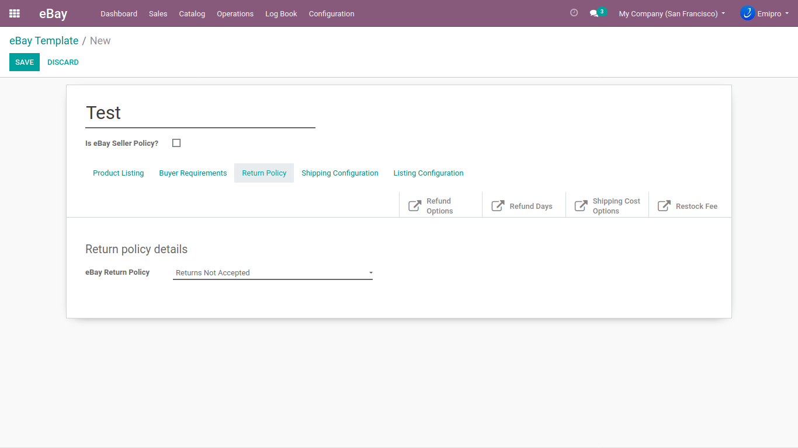

### Return Policy

You can configure the return policy for your products at the eBay store. It will be applicable to the customers when they return the product. Again, it is fetched by the operation of GeteBaydetails. You can choose if you want to accept or reject the return for the same product.

**eBay Return Policy:** This required field indicates whether or not the seller accepts returns.

Applicable values are **ReturnsAccepted** or **ReturnsNotAccepted.** When set to ReturnsAccepted, this option indicates the seller allows items to be returned. Specify ReturnsNotAccepted for a listing if returns are not accepted.

**ShippingCostPaidBy:** This option specifies whether the buyer or the seller pays for return shipping charges. Accepted values are Buyer or Seller. eBay sites often set Seller as to the default value for this field, and sellers are obligated to honor the values that are set for a listing. This value is required if **ReturnsAcceptedOption**=**ReturnsAccepted.**

**ReturnsWithin:** Specifies the amount of time the buyer has to return an item. The return period begins when the item is marked "delivered" at the buyer's specified ship-to location. Most marketplaces and categories support 30-day and 60-day return periods. eBay sites often set 30-days as the default value for this field and sellers are obligated to honor the values that are set for a listing. This value is required if **ReturnsAcceptedOption**=**ReturnsAccepted****.**

**RefundOption:** This field indicates how the seller compensates buyers for returns. You can set this value to either **MoneyBack** or **MoneyBackOrReplacement****.** MoneyBackOrReplacement can be used by sellers that have the depth of inventory to support exchange for an identical item. However, ultimately, it is up to the buyer on whether they want money back or a replacement item.

**Description:** The seller's description of the item. In listing requests, you can submit your description using CDATA if you want to use HTML or XML-reserved characters in the description. However, a seller can not use any active content in their listing description.

 

