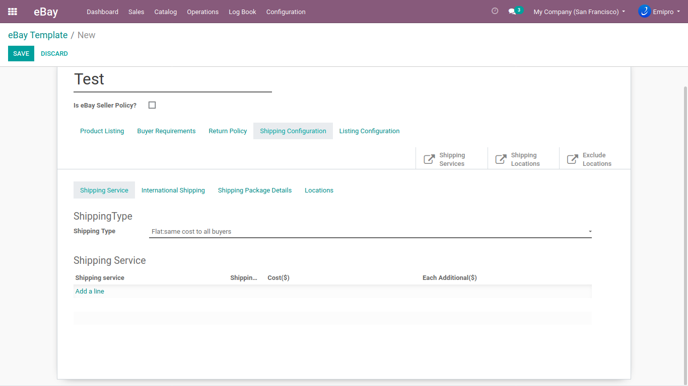

### Shipping Configuration

Here you can set the cost of **Shipping (Domestic) Service** or **International Shipping Services** based on the different locations or flat rates. In addition, you can also set the other shipping services and even **add the** **additional cost** in that. 

  

If you want to add package details for the shipping, you can add them from the same section. Select **Irregular Package** in case you are not sure of any information on it. For locations, you can set the perfect route of how the product will be shipped. The sellers selling across the major countries can choose **Ship Worldwide** from the options. If you want to specify the **region for particular locations**, you can add it by adding new locations in the same section.

