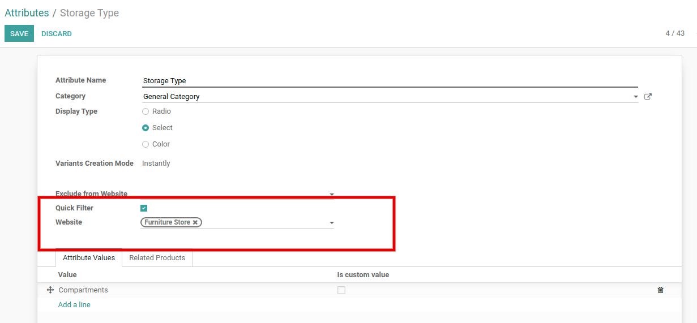
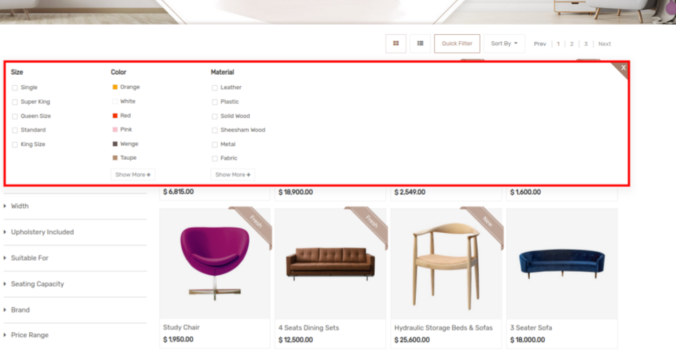

### eBay Marketplace Account Deletion/Closure Notifications

eBay provides their users a way to request that their personal data be deleted from eBay's systems, as well as deleted from the systems of all eBay partners who store/display their personal data, including third-party developers integrated with eBay APIs via eBay Developers Program.

To assist third-party developers in deleting customer data, eBay has created a push notification system that will notify all eBay Developers Program applications when an eBay user has requested that their personal data be deleted and their account closed. This document will discuss what third-party developers will need to do to receive, respond to, and validate these eBay marketplace account deletion/closure notifications.

 

## Step 1: Email to notify if marketplace account deletion notification endpoint is down

* Enter your email address, if the Odoo instance is down or the endpoint is not available in this case, eBay will send you a notification to delete customer details from the system.
* In this case, the seller's responsibility is to delete customer details from the system.

## Step 2: Marketplace account deletion notification endpoint

 

* Go to eBay >> Configuration >> Sellers and click on **Generate Endpoint.**
* Copy Endpoint and Edit in eBay developer account, In the field **Marketplace account deletion notification endpoint**.

## Step 3: Verification token

 

* Go to eBay >> Configuration >> Sellers and click on **Generate Verification Token.**
* Copy Endpoint and Edit in eBay developer account, In the field **Marketplace account deletion notification endpoint**.

## Step 4: Send Test Notification

* When you click on the button, the system will verify the endpoint with a verification token.
* Endpoints must be required with HTTPS protocol.

If any eBay customer account is deleted,  then the system will auto-delete all customer PII (Personal Identification Information) from the Odoo. Ex : name,address,phone number,email,etc.

