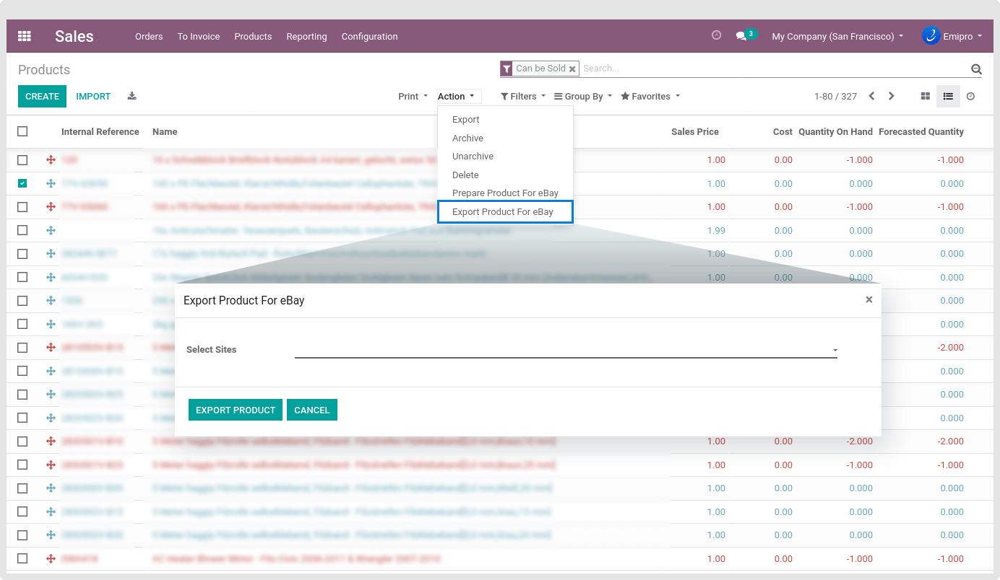
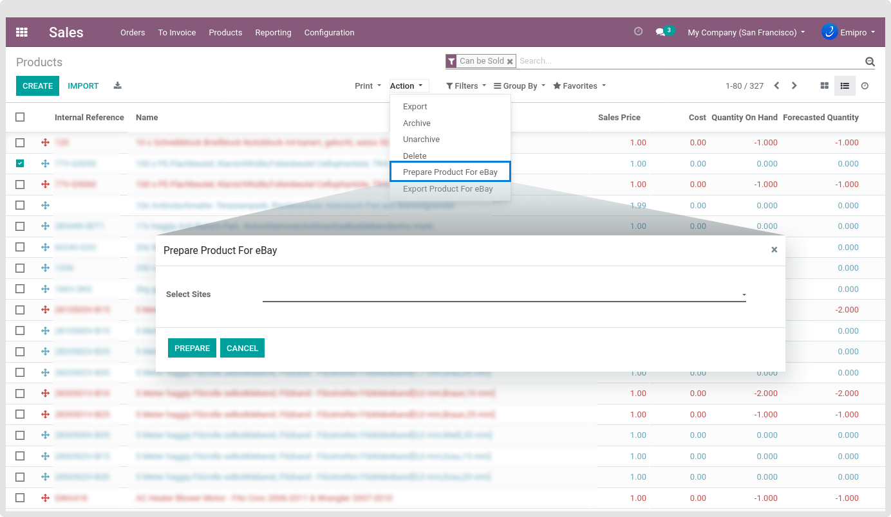
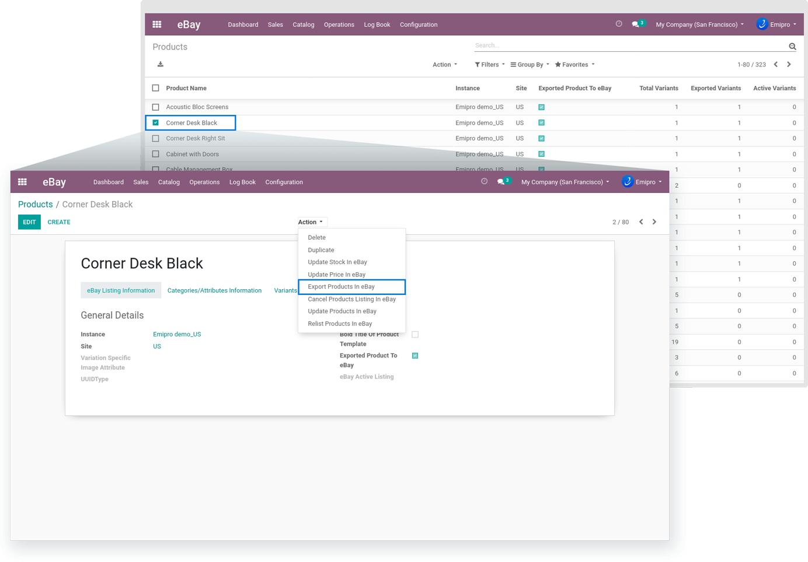

### Export Products in eBay

With this module, the product export from Odoo to eBay has been streamlined to avoid any unexpected hurdles with a dedicated layer. This layer will help you to prepare products according to the eBay standard before exporting them from Odoo. Now, let’s understand the complete process.

Before exporting the products to eBay, we need to first bring them to layers. Navigate to **Sales / Products / Products** and select any product that you want to export to eBay. In the list view, you can select multiple products to export. 

Now, there is a thing that you need to know while exporting products from Odoo to layer. You can export products to eBay in 2 ways. One is through CSV File and the other is directly export to the eBay layer in your Odoo.

 

To modify the product information in bulk, you should opt for exporting products to the **CSV file**. The same file is downloaded from Odoo to your hard disk and you can modify it the way you want. Post that, you can import that CSV file via Import eBay Products from the eBay operation. This way you can bring all your products to the eBay layer in Odoo.

After selecting the products, open the**Action** menu and click on **Prepare Products for eBay**. It will further ask you to select eBay Sites to which you want to export this product. Here, you can also select multiple sites if you have configured them in Odoo. In the end, click **Prepare** button.

 

Now, you will be able to see that product at **eBay / Catalog / Products**. However, it is not exported yet. At this stage, you need to configure the eBay products before we finally push them to eBay Site(s). Let’s take a look at the required configurations.

* **Primary Category:** This field is mandatory. It identifies what products belong to the particular category.
* **Store Category:** This field is optional. If you have created a store in eBay then you can set Store category.
* **Attributes:** It will have a list of Item Specific Attribute Name/Attribute Value pairs used by the seller to provide descriptive details of an item in a structured manner. You can not manually create the attribute from here. Refer to section 8.2 where it is specified how to get the Attributes.

{:.alert-info} 
> 
> #### TIP
> 
> You must have to set Brand and MPN attributes. If you have not branded so brand value set as Not Branded and if have not set the MPN value then set the value as Does not apply.
> 
> 
> 

Finally, we are on the stage where we can export the products to eBay after those successful configurations. Navigate to **eBay / Catalog / Products** then select the products which you want to export in eBay. Next, click on **Action** dropdown then on to Export Products In eBay to open the pop-up. You need to select the Listing Template and then select Start Listing Immediately option then click on **Export Products In eBay** button to export all products to eBay. 

 

If all products are successfully exported in eBay then Exported Product To eBay field will be automatically checked True in the eBay Listing Information tab. Besides, you can also identify how many variants exported in eBay using the Export Variants field and you can spot how many variants are active in eBay for sell based on the Active Variants field.

If you are exporting variant products then eBay will create variants for each product based on the stock availability. For example, if any product has 5 variants & among those 5 variants, in 3 variants stock available then eBay will create only 3 variants in the eBay store & 2 variants will be skipped by eBay. When the stock is available for those 2 variants, you can update the product again & eBay will create the other 2 variants in the eBay store.

In the end, if the products are not exported on eBay, it will create an eBay log with reasons why products are not exported on eBay. For example, some missing information, wrong information fill-up, stock not available, or other issues in products may cause the failure in the export process for eBay. You can check the eBay Log in menu **eBay / Odoo / eBay / eBay Logs / Process Job Log**.

