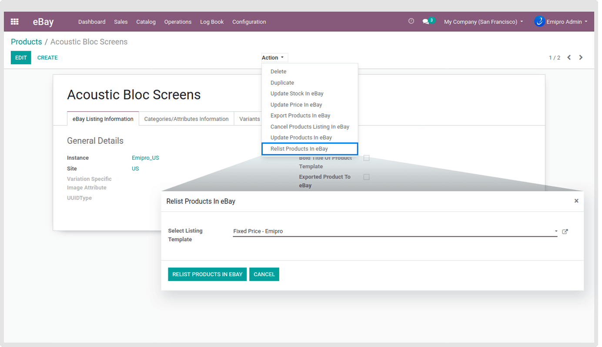

### Relist Product in eBay

Use this operation to Relist single or multiple auction-style items that have ended. The items may be relisted as it was originally defined. It will be presumed that the original item's listing must have ended so, in this event the relisting must be done within 90 days of the end of the original listing. Please note these criteria set by eBay itself.

You can Relist Products on eBay from **eBay / Catalog / Products** menu. You can select specific products from the list of products after clicking on to **Action** drop-down. Next, click on to **Relist Products In eBay** option to open a pop-up then Select Listing Template and then click on to **Relist Products In eBay** Button to relist selected products in eBay.

 

