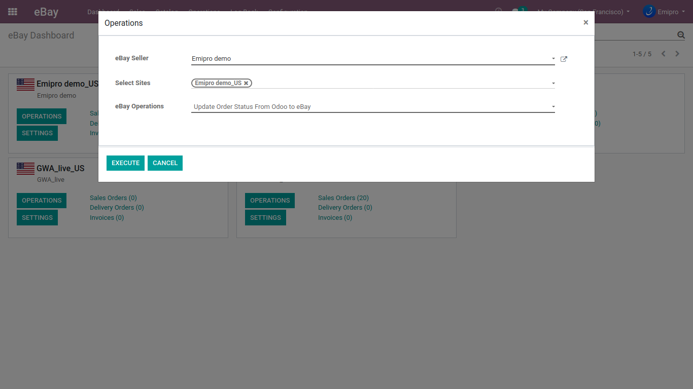

### Update Order Status in eBay

Update the actual status of the Sales Order in eBay from Odoo. Also, you can update the shipping/carrier tracking number from the Delivery Orders you want. The process is as simple as the others we saw above. 

Navigate to **eBay / Operations** and select **Update Order Status** **in eBay** operations. It will consider all the orders that are in the Done stage and its picking is Outgoing.

 

