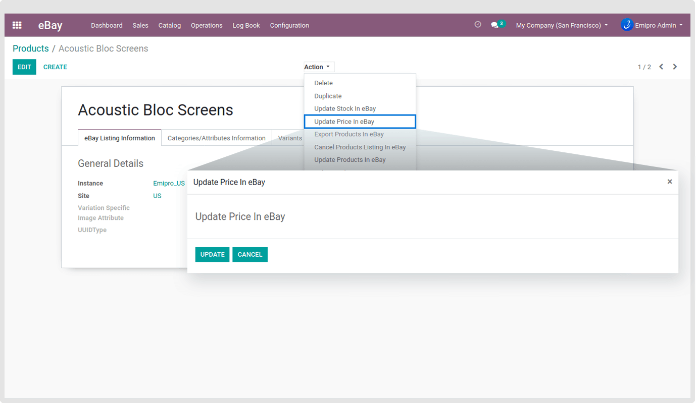

### Update Price in eBay

Updating product prices on eBay was never been easy when the environment is integrated. But, when we created the bridge between Odoo and eBay, essential operations are working flawlessly, and updating price is one of them. Based on Pricelist selected on each eBay Instance, your product's price can be updated directly at eBay.

Navigate to **eBay / Catalog / Product** menu and then select the product which you want to update the price. Next, click on the **Action** button then click on to **Update Price In eBay** option to open a pop-up, and then click on the **Update** button to update stock in eBay for the selected products.

There are no other ways to update the price of products from Odoo to eBay other than the above one.

 

