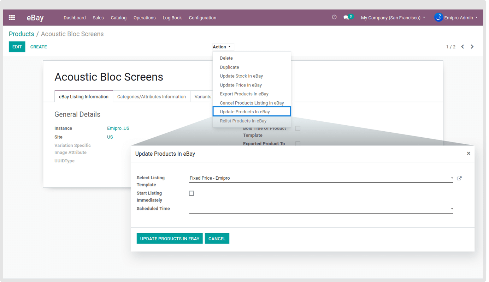

### Update Products in eBay

This operation is used when you perform necessary changes (Update) in the product information of a currently active listing. Also, this operation is analogous to the Revise (Update) Your Item (RYI) page on the eBay site. The item being revised (Update) must be a currently active listing. Please make sure that if a listing that has ended cannot be updated to eBay. A product whose listing is active can only be updated from Odoo to eBay.

Navigate to **eBay / Catalog / Products** and select products which you want to update in eBay. Click on the **Action** drop-down then click on **Update Products In eBay** where you can select the Listing Template and Start Listing Immediately. At last, click on to **Update Products In eBay** button to update all the products in eBay.

In case of any error, it will create a log at **eBay / Log Book / Operation Logs**.

 

