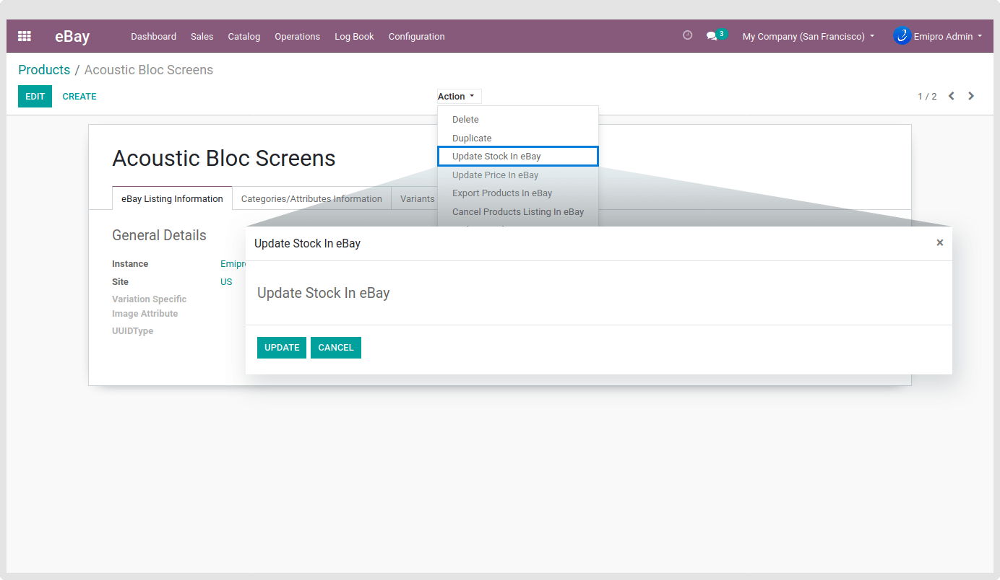
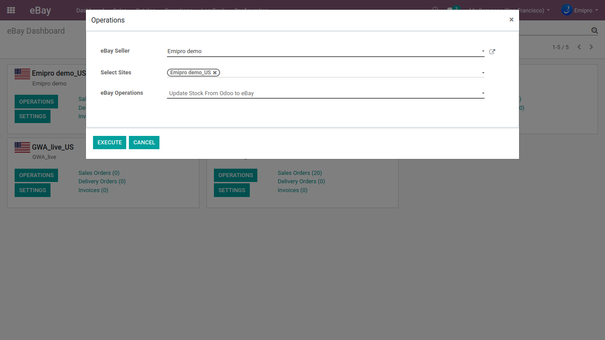

### Update Stock in eBay

Updating the stock at eBay can seem to be a tricky process initially but it will give you an edge in managing your inventory, specifically for eBay and even in multi-channel selling environments.

There are 2 ways to update the stock on eBay.

1. You can update stock for selected products/ product template for you have to go **eBay / Catalog / Product Variants** or **eBay / Catalog / Product** menu and then select the product which you want to update stock. Next, click on the **Action** button and then on to **Update Stock In eBay** option to open a pop-up. Later, click on the Update button to update stock in eBay for the selected products. Simple and Straightforward!

 

2. You can update all products stock for the selected instance so you have to go **eBay / Operations** and then select the instances. Click on the **Update Stock** option then click on **Execute** button to update stock from Odoo to eBay of all products for the selected instances in eBay. Another Simple!

 

Some important points to remember in the case of Products with Variants.

Firstly, for the variation products, for any variant, if you have 0 stock & other variants have a stock more than 0, then eBay will remove the stock with 0 variant while updating inventory at eBay from Odoo and the customer can see only stockable products in the drop-down list. Suppose if all variants of any product template have 0 stock then this app will cancel those listings via an automatic stock update process. You need to be attentive in this scenario!

However, if you wish to even allow the variants with 0 stock, you need to select **Allow out of stock?** During the creation of an instance. Once you have made the option true it will even allow stock with 0 quantity.

Secondly, for the non-Variation Product Stock Update - If the product stock is not available then this app will cancel the listing at eBay via automatic stock update process because you are not allowed to update 0 stock value in eBay.

