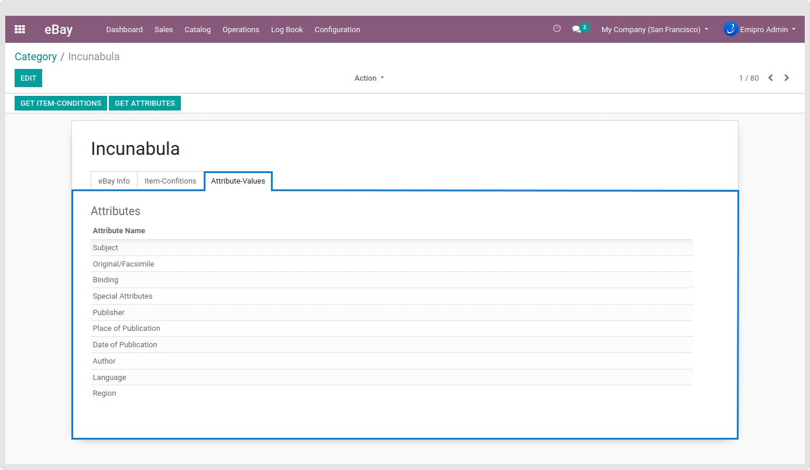

### Get Attributes

The information provided here will be used to describe the items' Brand, MPN, Color, etc.

Get Item Attributes by navigating to **eBay / Catalog / Categories / Open** any Category and Click on to **Get Attributes** button to open a pop-up where you need to give the Max Names Level and Max Value Per Name to import attributes.

**Max Names Level:** This field can be used if you want to limit the number of Item Specific names that are written for each eBay category. If you only wanted to retrieve the three most popular Item Specific names per category, you would include this field and set its value to 3.

**Max Value Per Name:** This field can be used if you want to limit the number of Item Specifics values (for each Item Specifics name) that are written for each eBay category. If you only wanted to retrieve the 10 most popular Item Specifics values per Item Specifics name per category, you would include this field and set its value to 10.

 

