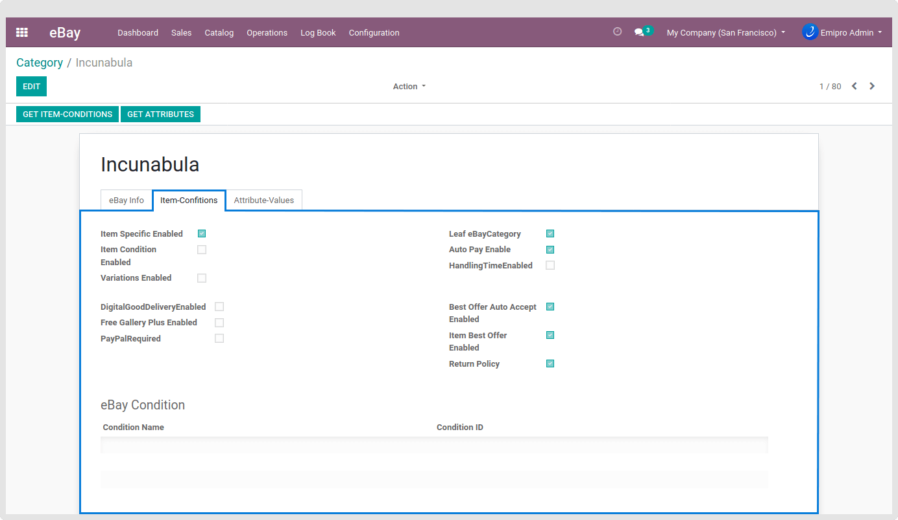

### Get Item Condition

These details are used by the user to clearly describe items that aren't brand new.

The following field should be used only to provide further details about the condition of the used item. For example, "The right leg of the chair has a small scratch, and on the seat back there is a light blue stain about the shape and size of a coin." It should not be used for branding, promotions, shipping, returns, payment, or other information related to the condition of the item.

You can Get Item Conditions by navigating to **eBay / Catalog / Categories / Open** any Category and Click on to **Get Item-Conditions** button to get all the conditions of the category or checked Get Item condition when import categories from operation wizard.

 

 

