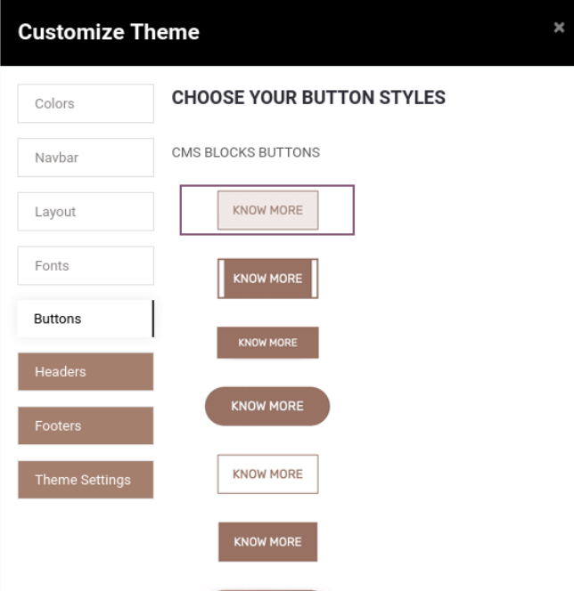

### How To Change Button Style?

* To change the button style , go to Web Pages -> Customize -> Customize Theme -> Button s and choose the button style.

* As shown in the above screenshot we provide 16 button styles so you can easily  

 configure the best button style as per your business needs.
* Button style 16 only for the gradient, in that we use Extra Color-2 and Extra Color-3 as per the screenshot above. You need to set up your gradient color in the Extra Colors option.

