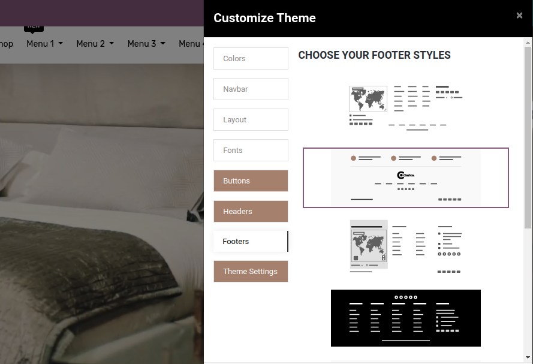

### How To Change Footer Style?

To change the footer style , go to Web Pages -> Customize -> Customize Theme -> Footer s and choose footer style. As shown in the above screenshot we provide 7 footer styles so you can easily configure the best footer as per your business needs.

We are providing dynamic map functionality in footer style 1, 3, 6. When using these particular footer style in your website, Map will show the address of your company that you have configured in the company of your current website.

Note: If there is no configured company address or map that can not locate your position, then Glob Map will be shown without any marker indication.

