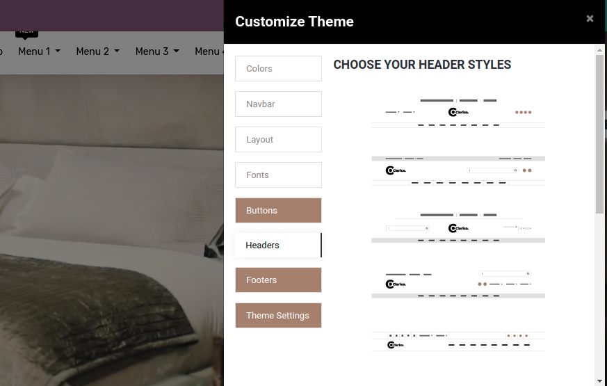

### How To Change Header Style?

To change the header style, go to Web Pages -> Customize -> Customize Theme as per the below screenshot.

As shown in the below screenshot we provide 11 header styles so you can easily configure the best header as per your business needs.

