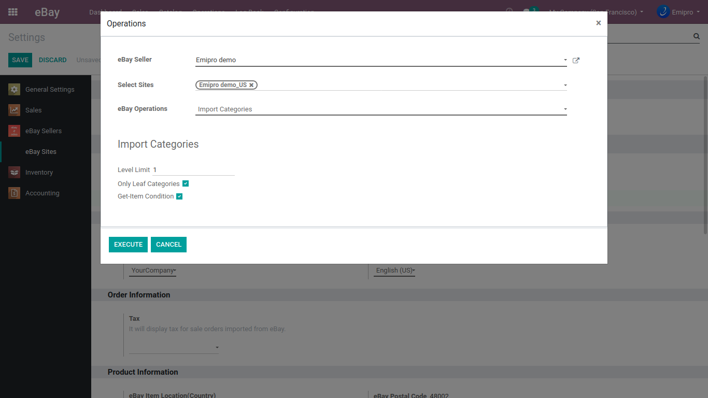

### Import Product Category

Navigate to **eBay / Operations / Import Categories** to get the product categories from eBay to Odoo. You can also set Level Limit and allow to fetch the Leaf Categories. Apart from this, you can also sync the Get-Item Condition which we will discuss in the next section. 

**Level Limit:** Specifies the maximum depth of the category hierarchy to import, where the top-level categories (meta-categories) are at level 1 which will import all category nodes with a category level less than or equal to this value. You can choose level 2 for sub-categories and so on.

**Only Leaf Categories:** This field controls whether all eBay categories (that satisfy input filters) are returned, or only leaf categories. 

If a category exists then imported Products will not be assigned to it. It has to be managed manually from the seller’s side.

 

