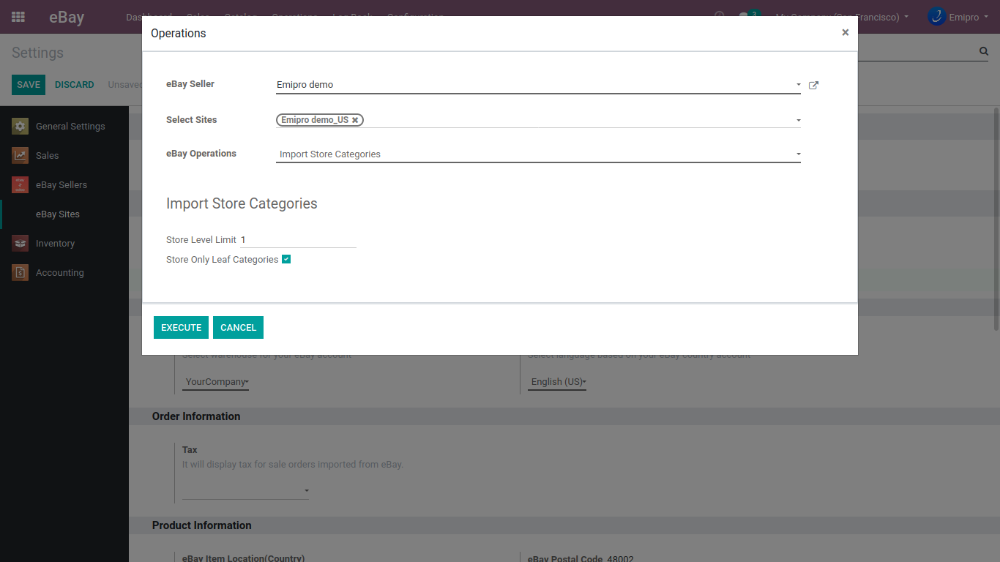

### Import Store Category

Navigate to **eBay / Operations / Import Store Categories** to get the product store categories from eBay to Odoo.

It will retrieve detailed information on a seller's eBay Store, including store theme information and eBay Store category hierarchy. On the other hand, the functioning of Level Limit and Leaf Categories while retrieving store categories will be the same as of product categories import process.

 

