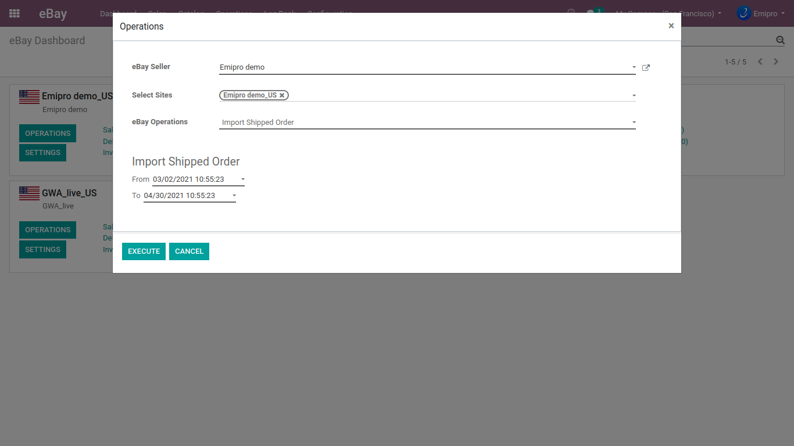

### Import Shipped Orders

On the other hand, you can also import the Shipped Order from eBay. While carrying out the operation for the same, you need to select the date range of the Sales Order that you want to import in Odoo. Note that, all the Sales Orders falling in the given date ranges will only be imported in Odoo. 

  

Select **Import Shipped Orders** from Operation pop-up and enter the date ranges as shown in the below screenshot.

 

