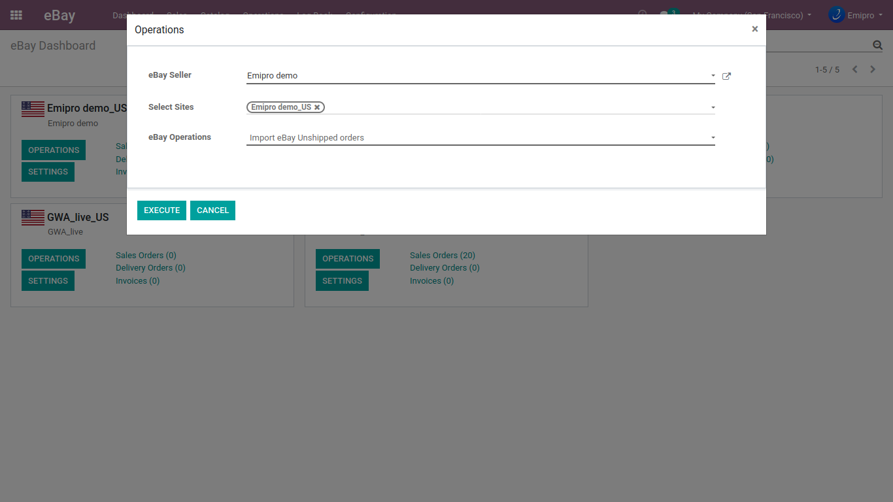

### Import Unshipped Orders

The orders which are not yet processed or fulfilled at eBay can be imported into Odoo. You can process a Sales Order completely in Odoo and export the Order Status later on. To import the Unshipped Orders from eBay, navigate to **eBay / Operations** and select **Import eBay Unshipped Orders** from the dropdown menu. Click on **Execute** button to get all the unshipped orders of the last 30 days from the last order import date from eBay. In case of any error, check the logs created at Log Book.

 

