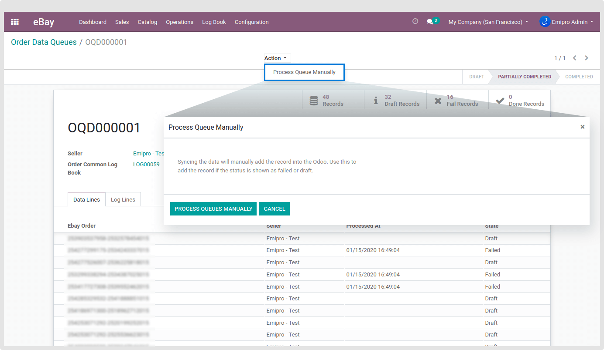

### Queues

The whole new way to import thousands of Products & Orders in a disciplined way and process it in Odoo in batch. With the Queue, you are actually processing the data in a batch where the load on system resources will be less compared to processing the data in a single shot. Import and process of data are the same but when it is configured for auto-process, it will follow this system.

All the Sales Order which is imported from eBay will be stored in the **eBay / Log Book / Order Data Queues****.** You can see all the queues here as shown in the screenshots below.

In certain cases, if your queue is stopped due to errors in data or in other situations, you can always manually process the whole queue later on. Open Action and click on **Process Queue Manually.**

 

