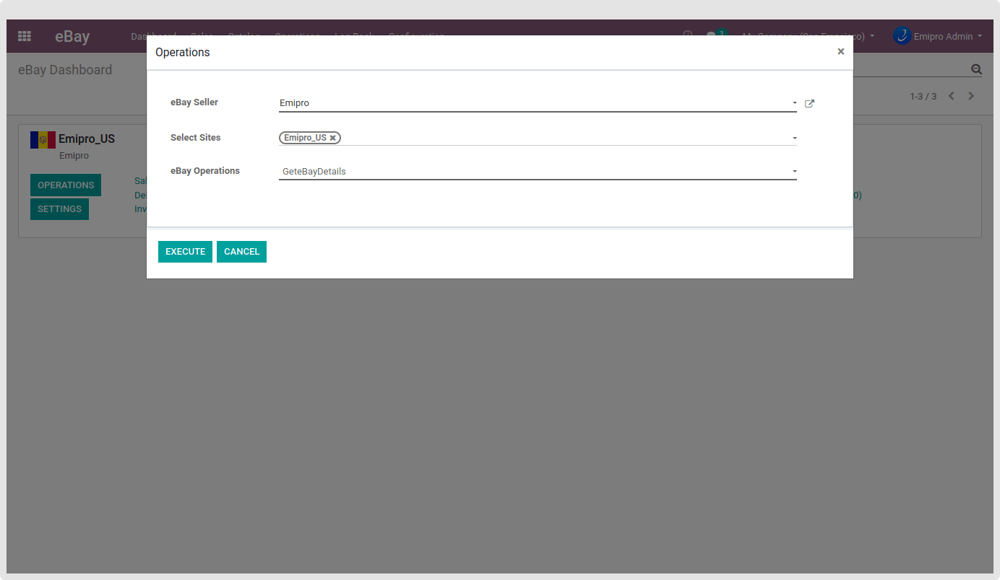

### Get User Preference

This operation will fetch the user preferences for the authenticated seller. eBay Seller Policy and eBay Out of Stock Options will be imported from the eBay seller account, and those policies will be used in the Product Export and Update process.

{:.alert-info} 
> 
> #### TIP
> 
> These two operations - Get eBay Details and Get User Preference are necessary before you proceed with the other eBay operations.
> 
> 
> 

 

