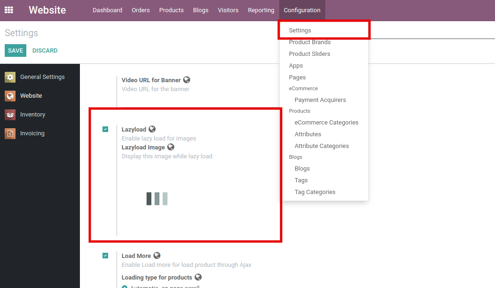

### Lazy Load

<iframe width="560" height="315" src="https://www.youtube.com/embed/S8CHUxnqewY" title="YouTube video player" frameborder="0" allow="accelerometer; autoplay; clipboard-write; encrypted-media; gyroscope; picture-in-picture" allowfullscreen></iframe>

It only loads the required portion and delays the remainder until it is needed by the user rather than loading the whole web page and rendering it to the user. 

To enable/disable the Lazy Load functionality, go to **Website / Configuration / Settings / Lazy Load.**

 

 

Users can set the image of the lazy load and it will be shown while page loading. Recommended Image size: 80 X 80.

Users can apply Lazy load on the Shop page, all the styles of Product slider & Offer slider, Category slider Brand slider, Offer Category Slider, Bestseller New product slider, Accessories and Alternative sliders.

