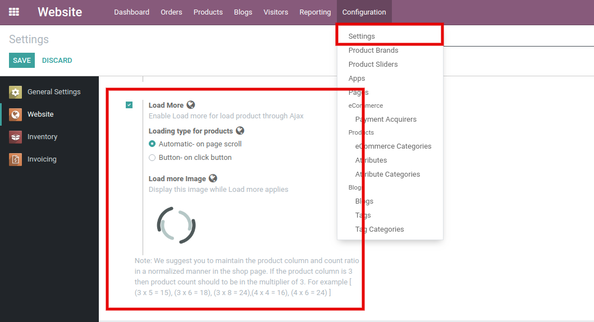
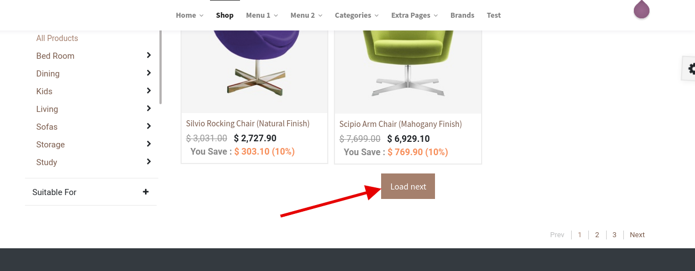
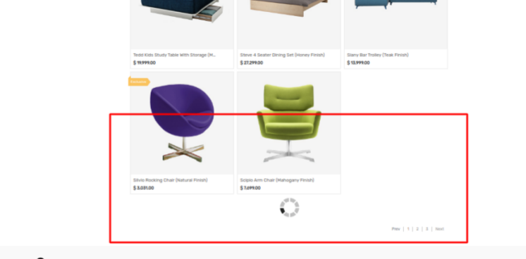

### Load More Products

Infinite Scroll / Load more is used to load more products through Ajax without refreshing the page.

To enable/disable the Infinite scroll/ Load More functionality, Go to the backend, **Website / Configuration / Settings.** Where you can see the Load More configuration inside Emipro Theme Settings tab as shown as below screenshot.

 

 

There are two types of product loading functionality:

1. Automatic- on page scroll
2. Button- on click button

 

You can set the Load More image in the website and that image will be applied at the time of Load More functionality.

{:.alert-info} 
> 
> #### TIP
> 
> We suggest you maintain the product column and count ratio in a normalized manner on the shop page. If the product column is 3 then product count should be in the multiplier of 3. For example [ (3 x 5 = 15), (3 x 6 = 18), (3 x 8 = 24),(4 x 4 = 16), (4 x 6 = 24) ]
> 
> 
> 

