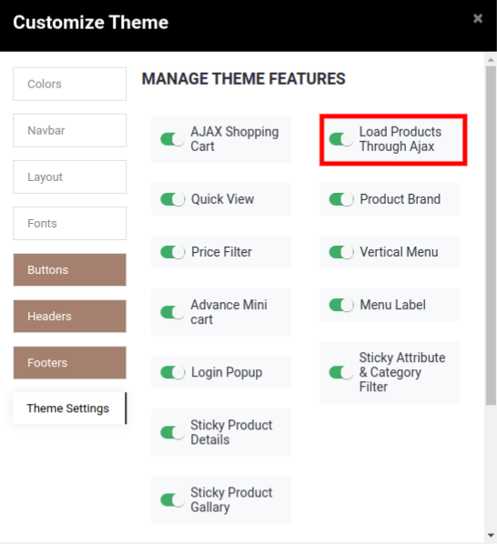

### Load Products Through Ajax

<iframe width="560" height="315" src="https://www.youtube.com/embed/l_jBj_H_8mE" title="YouTube video player" frameborder="0" allow="accelerometer; autoplay; clipboard-write; encrypted-media; gyroscope; picture-in-picture" allowfullscreen></iframe>

This feature provides the attribute filter data through ajax without reloading the page.

To enable/disable the Load through ajax, go to Web Pages -> Customize -> Customize Theme -> Theme Settings and set configure it as per your need.

{:.alert-info} 
> 
> #### TIP
> 
> Load Products Through the Ajax feature will work with attributes only.
> 
> 
> 

