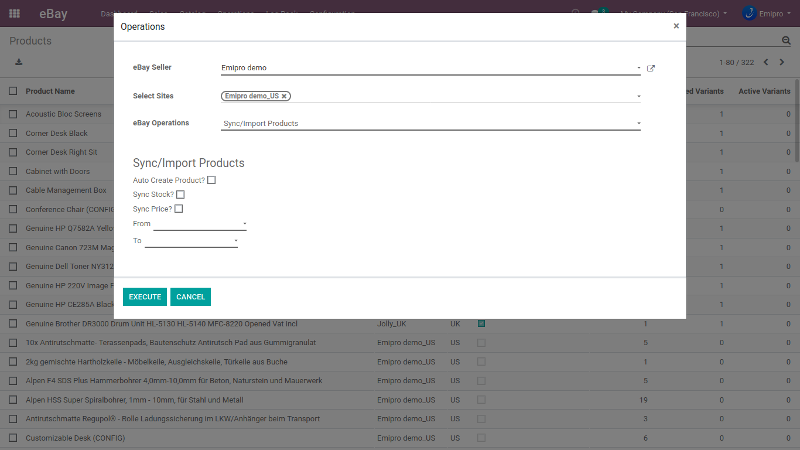
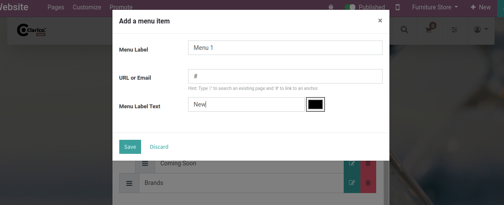
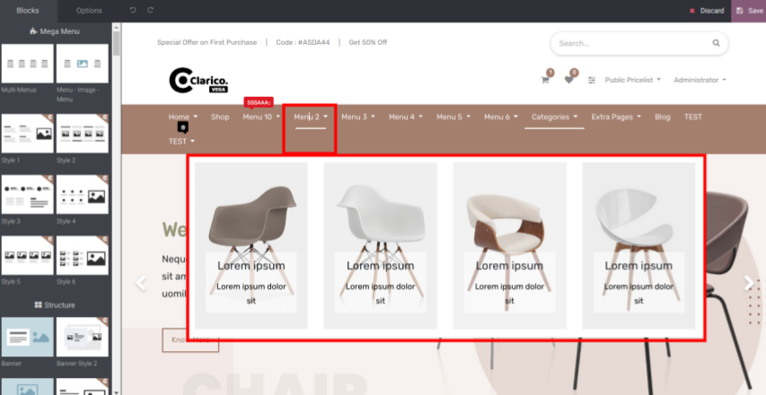

### Mega Menu

* To create a mega menu, go to a **Web Page / Pages / Edit Menu** and click on **Add Mega Menu Item**. It will show one popup to create a mega menu record.

 

 

Steps to set the mega menu style :

* **Step 1:** Go to the website and click on the edit button for open Website Editor.
* **Step 2:** Click on the mega menu in which you want to change the design.
* **Step 3:** Check the snippets list on the left side of the web page as shown in the above screenshot. There are 6 snippets available to change the menu styles.
* **Step 4:** Drag the snippet in the menu which you want to set and remove the old style that you set previously.

 

