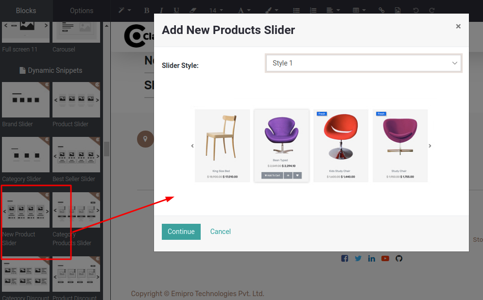

### New Product Slider

New Product dynamic slider is used to get the dynamic collection of new products that have been uploaded recently. The data (Statistics) for the last 10 products uploaded will be taken into account.

To apply New Product Slider, open Website Editor from the Website & you can find ‘New Product Slider’ snippet inside Dynamic Slider as per the below screenshot. Once you select & drop that snippet, you can configure the slider style as per your need.

