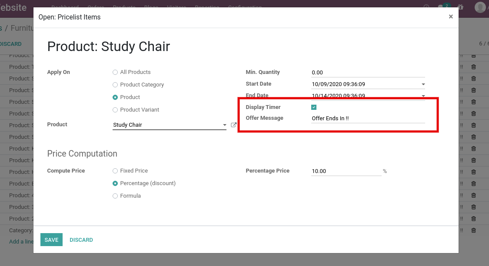
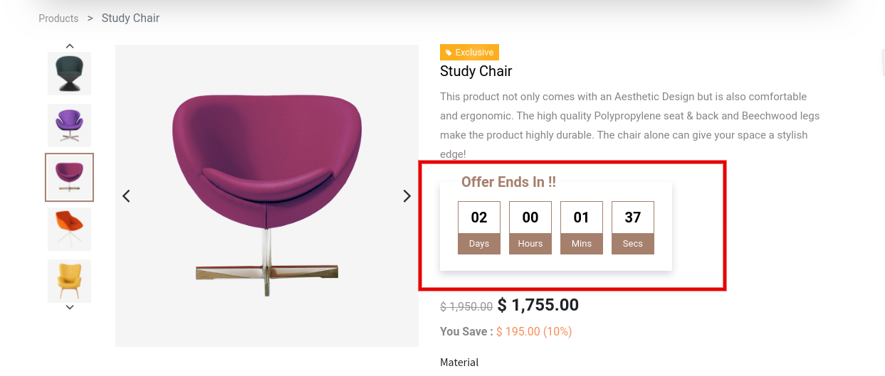

### Offer Timer

We are providing an offer timer based on All Products, Product Category, Product and Product variants. It shows the remaining time countdown of product offers on a product page.

To configure the offer timer, you need to configure a pricelist. Make sure the discount and multiple sale pricing are activated from the website settings. Once you click on Add a line of pricelist, One pop up will open. Select appropriate ‘Apply on’ option and configure Start Date, End Date, Display Timer and Offer Message.

 

 

 

You can see the Offer timer in the Product page as shown in above screenshot.

