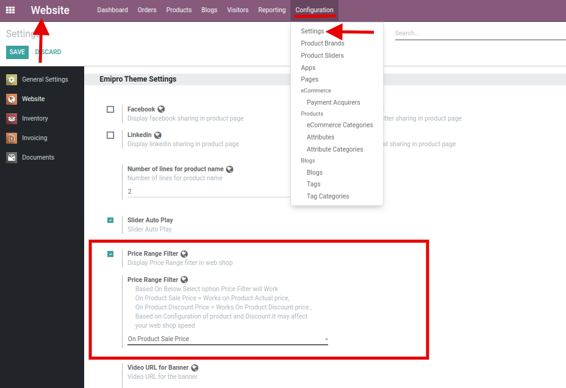
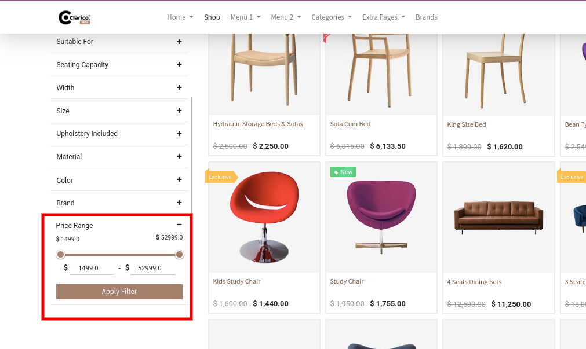

### Price Filter Configuration

To enable Price Filter, go to **Website / Configuration / Settings** in Odoo backend. Where you can find Price Range Filter configuration inside the Emipro Theme Settings tab. When you enable that configuration, you can see one selection related to the behaviour of Price Filter.

1. On Product Sale Price: Works on Product Actual (Sales) price
2. On Product Discount Price: Works On Product Discount price, Based on Configuration of product and Discount. It may affect your webshop speed

 

