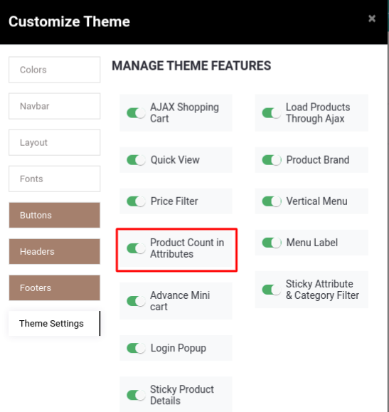

### Product Count In Shop Filter

<iframe width="560" height="315" src="https://www.youtube.com/embed/MIfEhy6Ptxg" title="YouTube video player" frameborder="0" allow="accelerometer; autoplay; clipboard-write; encrypted-media; gyroscope; picture-in-picture" allowfullscreen></iframe>

This feature displays the associated product count in the Attribute listing. To enable Product Count in Shop Filter, open theme customize panel. You can find the product Count in Shop Filter option as shown in the below screenshot. Enable that option & save the changes.

 

After enabling this option, you can see the count of Products in Attribute listing as per the below screenshot.

