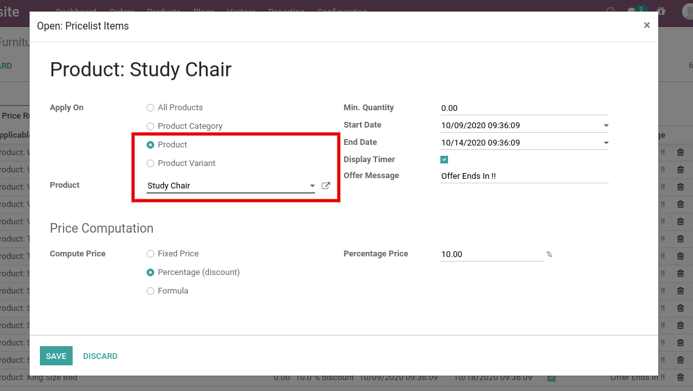
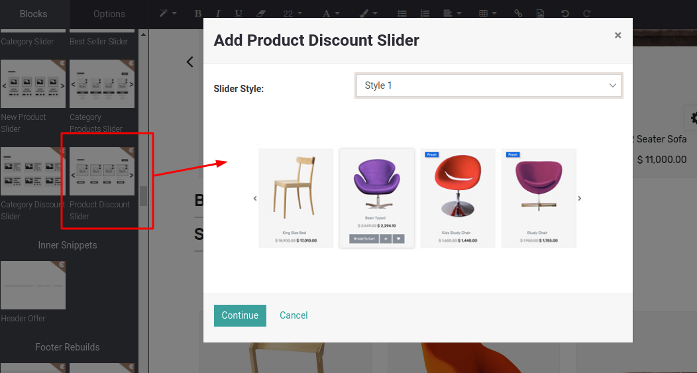

### Product Discount Slider

Product discount slider is a dynamic snippet which displays all the discounted products from the current price list. You can use this snippet in the Brand landing page, Category landing page as per your need. With the help of other discount sliders, you can easily create an Offer Zone/ Offer Page on your website.

Steps to configure the Product Discount Slider:

* **Step 1:** Configure Pricelist items with product option as per the below screenshot.

 

 

* **Step 2:** Open Website Editor from the Website & you can see the ‘Category Product Slider’ snippet inside Dynamic Snippet as shown below screenshot. Once you drag & drop that snippet, one popup will be displayed. Where you can select multiple categories as well as slider style & discount option as per the below screenshot.

 

