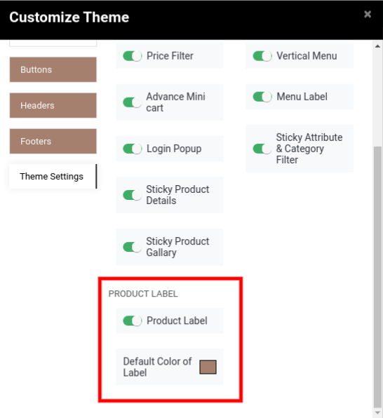
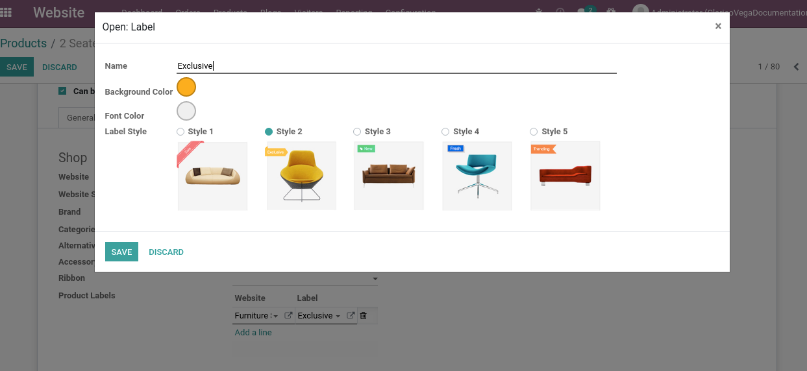
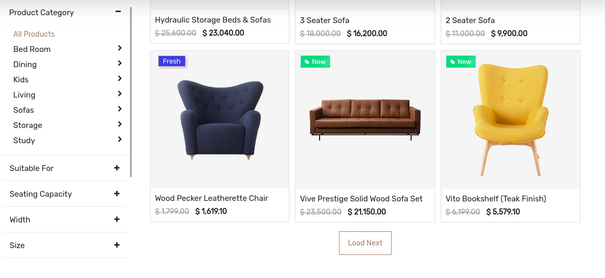

### Product Label

<iframe width="560" height="315" src="https://www.youtube.com/embed/w10PIp_9qCM" title="YouTube video player" frameborder="0" allow="accelerometer; autoplay; clipboard-write; encrypted-media; gyroscope; picture-in-picture" allowfullscreen></iframe>

* To enable/disable the Product Label , go to Web Pages -> Customize -> Customize Theme -> Theme Settings and set Product Label. Also, You can select the default color of the label as per the below screenshot.

Steps to configure the product label:

 

* **Step 1:** Open the product records in the backend admin side. You can see the ProductLabeloption inside the eCommerce tab as shown in the below screenshot. Where you can you can configure the product label with different styles as well as custom color based on the websites.

 

 

As per the above screenshot, you can customize the Product label also.

