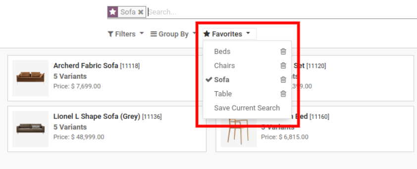
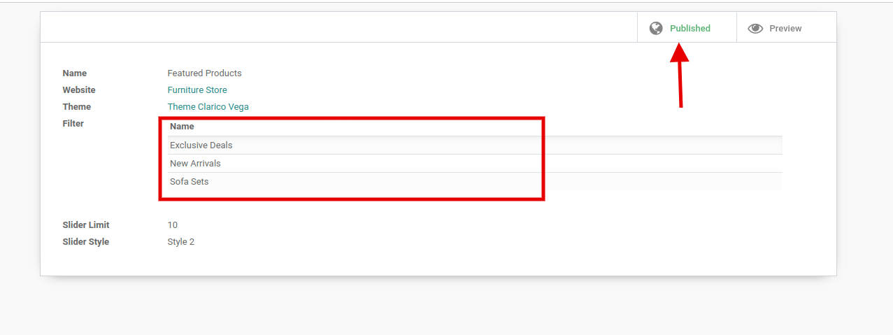
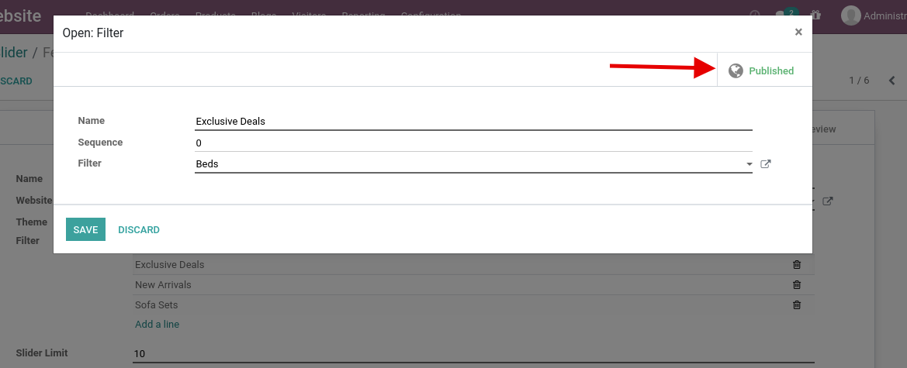
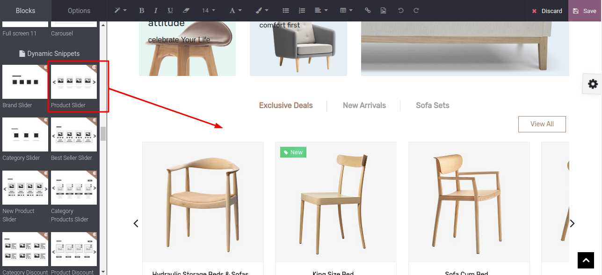

### Product Slider

Steps to configure the product slider:

* **Step 1:** To configure the product slider, first you need to create a filter from the Product Template view. As shown in the below screenshot, go to the product view and create a filter by searching the products and save the filter.

* **Step 2:** After configuring the filter. You need to create a slider record for configuring the slider. For that go to Admin side, **Website / Configurations / Product Slider**.

 

 

Once you click on add a line, one popup will open. Select the filter and publish that.

 

 

 

* **Step 4:** Set products limit and select slider style. 6 different slider styles are provided in this theme. Each style contains different designs. After selecting slider styles, activate the record from the top right. You can also get a preview of styles by clicking on the preview button at the top right corner.

{:.alert-info} 
> 
> #### TIP
> 
> Do not forget to publish this record by clicking on the Published button at the top right corner. If you don’t publish this record, you can’t get this slider option in Popup.
> 
> 
> 
> 
> 

* **Step 5:** Now, Go to the website and open Website Editor & apply the Product Slider snippet from Dynamic Snippet portion as shown below screenshot. Select the Product Slider record from the popup & save the changes.

