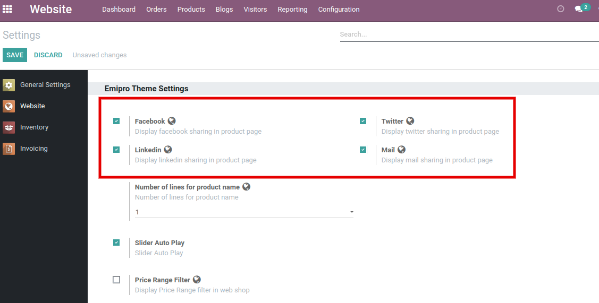
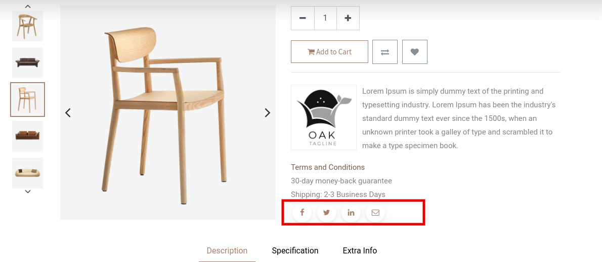

### Product Social Sharing

To configure Social share features. Go to Admin side, **Website / Configuration / Settings**. There is one of "Product Social Sharing". Select the social checkbox which you want to set on the product page and save your changes.

 

