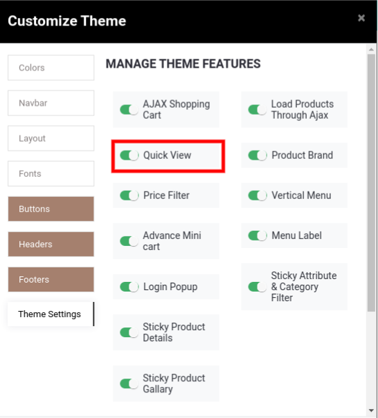
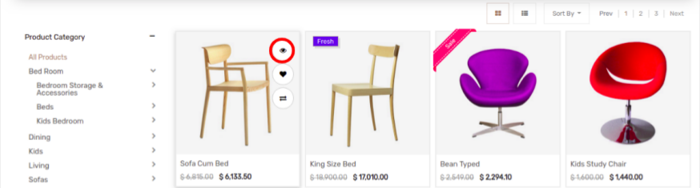
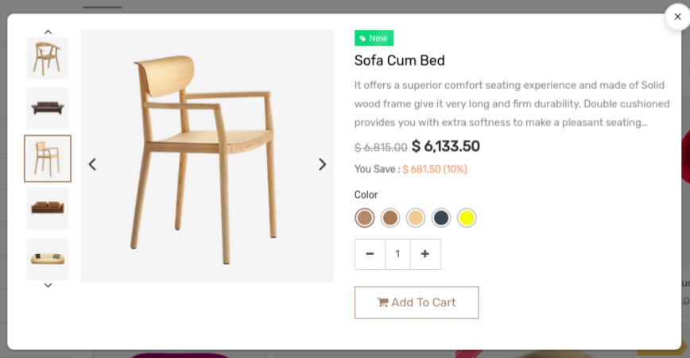

### Quick View

<iframe width="560" height="315" src="https://www.youtube.com/embed/Ht9dmfxn_FQ" title="YouTube video player" frameborder="0" allow="accelerometer; autoplay; clipboard-write; encrypted-media; gyroscope; picture-in-picture" allowfullscreen></iframe>

Once you enable that option, you can see the Quick view effects in the New product slider, Bestseller, all offers snippets and other product sliders having dynamic snippet.

To enable/disable the Quick View, go to Web Pages -> Customize -> Customize Theme - > Theme Setting and configure it.

 

