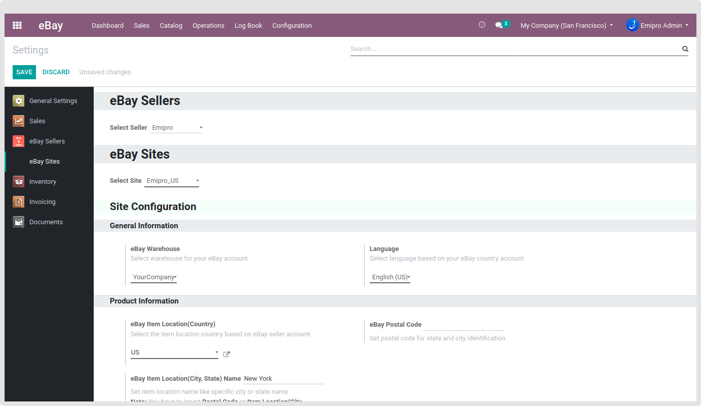
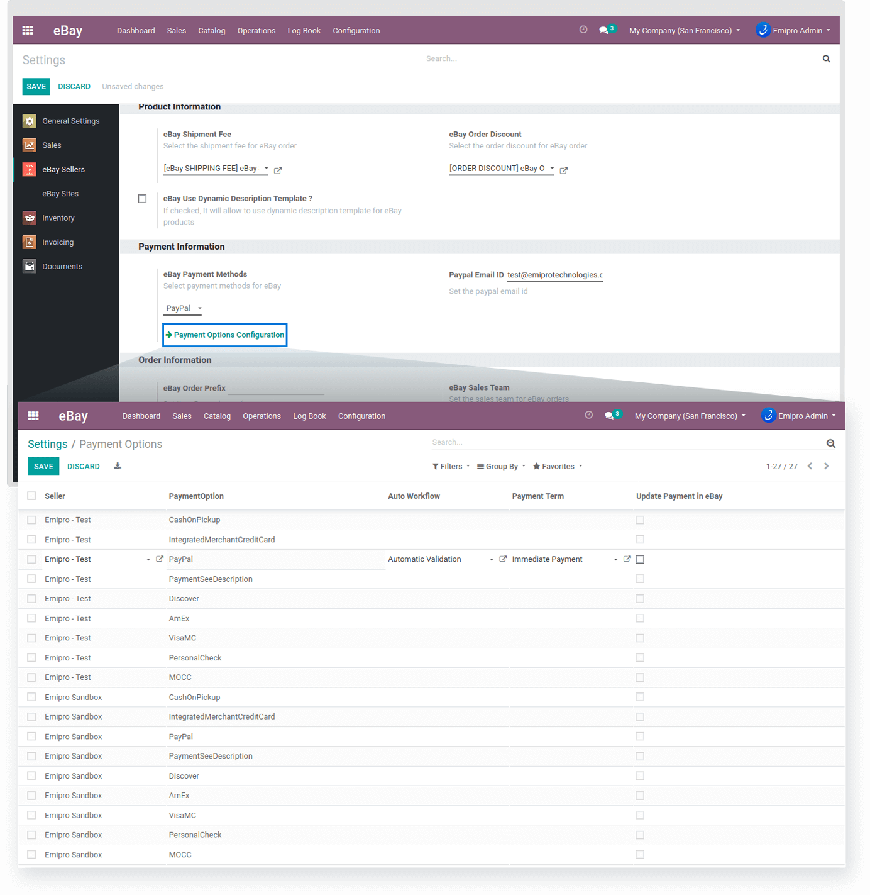
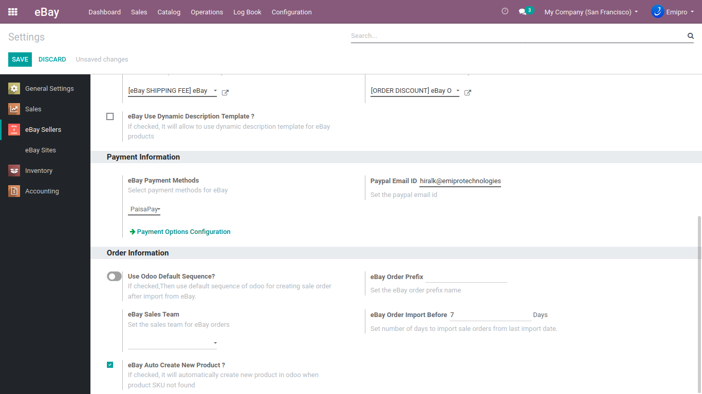

### Configure the new seller

After creating the new seller, you need to configure it on Odoo. Let’s configure all the necessary parameters in order to manage eBay from Odoo.

 

### **General Information:**

**Is eBay Plus Account:** If you are using the eBay Plus account, check the box. The benefits of the eBay Plus account are managed by eBay, and it will not affect any of the operations in Odoo.

**eBay Company:** Select the company configured in Odoo in which you want to maintain your eBay records and carry out operations.

 

### **Product Information:**

**eBay Shipping Fee:** Select the shipping product for order lines that are applicable to eBay orders. You can also create or modify the shipping fee from here.

**eBay Order Discount:** Select the discount product for order lines that are applicable to eBay orders. You can also create or modify the new order discount from here.

**eBay Use Dynamic Description Template:** Check this box to use the dynamic description template for eBay products.

 

### **Payment Information:**

**eBay Payment Methods:** Select the payment methods offered by eBay for sellers. At present, PayPal and PaisaPay are the preferred payment methods by eBay.

**PayPal Email ID:** Enter your PayPal email address to receive the payment from eBay in your PayPal account.

However, you can also configure other payment methods too by clicking on the Payment Options Configuration button. Click on it and the payment options will appear in front of you. You can Create and Manage all the payment options from the list as shown in below screenshots.

 

You can also set an Auto Workflow and [Payment Terms](https://www.odoo.com/documentation/user/14.0/accounting/receivables/customer_invoices/payment_terms.html) for each payment method you create for your eBay account.

### **Order Information:**

**Use Odoo Default Sequence:** If it is checked, the imported orders from eBay will be seen the same as Odoo default Sales Order. To visibly differentiate it, we recommended not to use this option.

**eBay Order Prefix:** You can set any prefix for the Sales Orders imported from eBay to Odoo. The prefix will be added to a unique ID of sales order to distinguish them in case of multiple sales channels.

**eBay Sales Team:** You can select the specific sales team for managing Sales Orders from eBay.

**eBay Order Import Before \_\_\_\_\_\_\_ Days:** Enter the number of days in the empty field to import the Sales Order from eBay from the past. For example, if you enter ‘7' in the field and the last order import date is 14 June, it will import the orders from eBay from 07 June.

**eBay Auto Create New Product:** By checking this box, it will create new products in your catalog if the product is not found based on the SKU / Internal Reference / Default Product Code.

If you are selling on multiple sales channels and having different **SKU / Internal Reference / Default Product Code** on each sales channel, it may lead to the creation of duplicate products in your product catalog in your database.

{:.alert-info} 
> 
> #### TIP
> 
> This is only recommended when there is no product data in your Odoo. If you have an existing product catalog, we recommend not enabling this option at the initial stage.
> 
> 
> 

However, upon enabling this option if the product in eBay has the variants, the new product created in Odoo will also be in a variant instead of a simple product.

 

